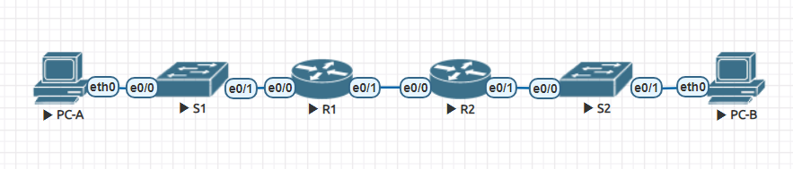

# Лабораторная работа №3.1 Реализация DHCPv4
### Цели:
1. Создание сети и настройка основных параметров устройства
2. Настройка и проверка двух серверов DHCPv4 на R1
3. Настройка и проверка DHCP-ретрансляции на R2

### Решение:
### 1. Создание сети и настройка основных параметров устройства
#### Шаги
1. Создать схему адресации
2. Создать сеть согласно топологии
3. Настроить базовые параметры каждого маршрутизатора
4. Настроить маршрутизацию между сетями VLAN на маршрутизаторе R1
5. Настроить G0/0/1 на R2, затем G0/0/0 и статическую маршрутизацию для обоих
маршрутизаторов
6. Настроить базовые параметры каждого коммутатора
7. Создать сети VLAN на коммутаторе S1
8. Назначить сети VLAN соответствующим интерфейсам коммутатора
9. Вручную настроить интерфейс S1 F0/5 в качестве транка 802.1Q

### Таблица адресации
| Устройство | Интерфейс    |  IP-адрес    | Маска подсети  | Шлюз по умолчанию |
|------------|--------------| ------------ |--------------- |-------------------|
| R1         | G0/0/0       | 10.0.0.1     | 255.255.255.252| N/A               |
|            | G0/0/1       | N/A          | N/A            |                   |
|            | G0/0/1.100   | —            | —              |                   |
|            | G0/0/1.200   | —            | —              |                   |
|            | G0/0/1.1000  | N/A          | N/A            |                   |
| R2         | G0/0/0       | 10.0.0.2     | 255.255.255.252| N/A               |
|            | G0/0/1       |              |                |                   |
| S1         | VLAN200      |              |                |                   |
| S2         | VLAN1        |              |                |                   |
| PC-A       | NIC          | DHCP         | DHCP           | DHCP              |
| PC-B       | NIC          | DHCP         | DHCP           | DHCP              |

### Таблица VLAN
| VLAN       | Имя        | Назначенный интерфейс                                                        |
|------------|------------| -----------------------------------------------------------------------------|
| 1          | N/A        | S2: F0/18                                                                    |
| 100        | Clients    | S1: F0/6                                                                     |
| 200        | Management | S1: VLAN 200                                                                 |
| 999        | ParkingLot | S1: F0/1-4, F0/7-24, G0/1-2 <br/> S2: F0/1-4, F0/6-17, F0/19-24,<br/> G0/1-2 |
| 1000       | Native     | N/A                                                                          |


Создаём схему адресации. Необходимо разделить пул IP-адресов 192.168.1.0/24 на 3 подсети в соответствии с требованиями:

1. Подсеть А должна включать 58 хостов (Client VLAN маршрутизатора R1). Первый IP-адрес подсети должен быть назначен маршрутизатору R1 на порт G0/0/1.100
2. Подсеть В должна включать 28 хостов (Management VLAN маршрутизатора R1). Первый IP-адрес подсети должен быть назначен маршрутизатору R1 на порт G0/0/1.200, а второй IP-адрес должен быть назначен коммутатору S1.
3. Подсеть C должна включать 12 хостов (Client сеть маршрутизатора R2). Первый IP-адрес подсети должен быть назначен маршрутизатору R2 на порт e0/1.

В результате получаем следующую таблицу адресации.

### Таблица адресации
| Устройство | Интерфейс    |  IP-адрес    | Маска подсети  | Шлюз по умолчанию |
|------------|--------------| ------------ |--------------- |-------------------|
| R1         | G0/0/0       | 10.0.0.1     | 255.255.255.252| N/A               |
|            | G0/0/1       | N/A          | N/A            | N/A               |
|            | G0/0/1.100   | 192.168.1.1  | 255.255.255.192| N/A               |
|            | G0/0/1.200   | 192.168.1.65 | 255.255.255.224| N/A               |
|            | G0/0/1.1000  | N/A          | N/A            | N/A               |
| R2         | G0/0/0       | 10.0.0.2     | 255.255.255.252| N/A               |
|            | G0/0/1       | 192.168.1.97 | 255.255.255.240| N/A               |
| S1         | VLAN200      | 192.168.1.66 | 255.255.255.224| 192.168.1.65      |
| S2         | VLAN1        | 192.168.1.98 | 255.255.255.240| 192.168.1.97      |
| PC-A       | NIC          | DHCP         | DHCP           | DHCP              |
| PC-B       | NIC          | DHCP         | DHCP           | DHCP              |

Создаём сеть согласно топологии:  


Настроим базовые параметры маршрутизаторов. 
#### Маршрутизатор R1:
```
en
conf t
no ip domain-lookup
hostname R1
enable secret class
line vty 0 4
  password cisco
  login
line console 0
  password cisco
  login
  logging synchronous
banner motd % Unathorized access is prohibited % 
interface vlan 1
  ip address 192.168.1.1 255.255.255.0
  no shutdown
copy running-config startup-config
```
#### Маршрутизатор R2:
```
en
conf t
no ip domain-lookup
hostname R2
enable secret class
line vty 0 4
  password cisco
  login
line console 0
  password cisco
  login
  logging synchronous
banner motd % Unathorized access is prohibited % 
interface vlan 1
  ip address 192.168.1.2 255.255.255.0
  no shutdown
copy running-config startup-config
```

Настроим маршрутизацию между VLAN на маршрутизаторе R1.

#### Маршрутизатор R1:
```
int G0/0/1
  no shutdown
int G0/0/1.100
  description Clients
  encapsulation dot1q 100
  ip address 192.168.1.1 255.255.255.192
int G0/0/1.200
  description Management
  encapsulation dot1q 200
  ip address 192.168.1.65 255.255.255.224
int G0/0/1.1000
  description Native
  encapsulation dot1q 1000 native
```

Настроим интерфейс G0/0/1 на маршрутизаторе R2.
#### Маршрутизатор R2:
```
int G0/0/1
  no shutdown
  ip address 192.168.1.97 255.255.255.240
```

Настроим интерфейс G0/0/0 для каждого маршрутизатора, а также шлюз по умолчанию.
#### Маршрутизатор R1:
```
int G0/0/0
  no shutdown
  ip address 10.0.0.1 255.255.255.252
  ip route 0.0.0.0 0.0.0.0 10.0.0.2
copy running-config startup-config
```

#### Маршрутизатор R2:
```
int G0/0/0
  no shutdown
  ip address 10.0.0.2 255.255.255.252
  ip route 0.0.0.0 0.0.0.0 10.0.0.1
copy running-config startup-config
```

Проверим доступность.
#### Маршрутизатор R1:
```
R1#ping 192.168.1.97

Type escape sequence to abort.
Sending 5, 100-byte ICMP Echos to 192.168.1.97, timeout is 2 seconds:
.!!!!
Success rate is 80 percent (4/5), round-trip min/avg/max = 0/0/0 ms
```

Настроим базовые параметры каждого коммутатора.
#### Коммутатор S1:
```
en
conf t
hostname S1
no ip domain-lookup
enable secret class
line vty 0 4
  password cisco
  login
line console 0
  password cisco
  login
service password-encryption
banner motd "Unathorized access is prohibited"
copy running-config startup-config
```
#### Коммутатор S2:
```
en
conf t
hostname S2
no ip domain-lookup
enable secret class
line vty 0 4
  password cisco
  login
line console 0
  password cisco
  login
service password-encryption
banner motd "Unathorized access is prohibited"
copy running-config startup-config
```

Настроим VLAN на обоих коммутаторах и отключим.
#### Коммутатор S1:
```
vlan 100
  name Clients
vlan 200
  name Management
vlan 999
  name ParkingLot
vlan 1000
  name Native
int vlan 200
  ip address 192.168.1.66 255.255.255.224
  no shutdown
ip default-gateway 192.168.1.65
int range F0/1-4,F0/7-24,G0/1-2
  switchport mode access
  switchport access vlan 999
  shutdown
```

#### Коммутатор S2:
```
vlan 100
  name Clients
vlan 200
  name Management
vlan 999
  name ParkingLot
vlan 1000
  name Native
int vlan 1
  ip address 192.168.1.98 255.255.255.240
  no shutdown
ip default-gateway 192.168.1.97
int range Fa0/1-4,Fa0/6-17,Fa0/19-24,G0/1-2
  switchport mode access
  switchport access vlan 999
  shutdown
```

Назначим сети VLAN соответствующим интерфейсам коммутаторов.
#### Коммутатор S1:
```
int Fa0/6
  switchport mode access
  switchport access vlan 100
```
#### Коммутатор S2:
```
int Fa0/18
  switchport mode access
  switchport access vlan 1
```

Настроим интерфейс Fа0/5 на коммутаторе S1.
#### Коммутатор S1:
```
int Fa0/5
  switchport mode trunk
  switchport trunk native vlan 1000  
  switchport trunk allowed vlan 100,200,1000
```

### 2. Настройка и проверка двух серверов DHCPv4 на R1
#### Шаги
1. Настроить R1 с пулами DHCPv4 для двух поддерживаемых подсетей
2. Сохранить конфигурацию
3. Проверить конфигурацию сервера DHCPv4
4. Попытаться получить IP-адрес от DHCP на PC-A

Настроим DHCP на R1.
#### Маршрутизатор R1:
```
ip dhcp excluded-address 192.168.1.1 192.168.1.5
ip dhcp excluded-address 192.168.1.97 192.168.1.101
ip dhcp pool VLAN100
  network 192.168.1.0 255.255.255.192
  default-router 192.168.1.1
  domain-name ccna-lab.com
ip dhcp pool R2_Client_LAN
  network 192.168.1.96 255.255.255.240
  default-router 192.168.1.97
  domain-name ccna-lab.com
copy running-config startup-config
```
Команда **lease** не поддерживается в Cisco Packet Tracer.

Проверяем конфигурацию сервера DHCPv4.
#### Маршрутизатор R1:
```
R1#show ip dhcp pool

Pool VLAN100 :
 Utilization mark (high/low)    : 100 / 0
 Subnet size (first/next)       : 0 / 0 
 Total addresses                : 62
 Leased addresses               : 0
 Excluded addresses             : 2
 Pending event                  : none

 1 subnet is currently in the pool
 Current index        IP address range                    Leased/Excluded/Total
 192.168.1.1          192.168.1.1      - 192.168.1.62      0    / 2     / 62

Pool R2_Client_LAN :
 Utilization mark (high/low)    : 100 / 0
 Subnet size (first/next)       : 0 / 0 
 Total addresses                : 14
 Leased addresses               : 0
 Excluded addresses             : 2
 Pending event                  : none

 1 subnet is currently in the pool
 Current index        IP address range                    Leased/Excluded/Total
 192.168.1.97         192.168.1.97     - 192.168.1.110     0    / 2     / 14

R1#show ip dhcp binding
IP address       Client-ID/              Lease expiration        Type
                 Hardware address
```
Команда **show ip dhcp server statistics** не поддерживается в Cisco Packet Tracer.

Получим IP-адрес от DHCP на PC-A.
#### PC-A
```
C:\>ipconfig /renew

   IP Address......................: 192.168.1.6
   Subnet Mask.....................: 255.255.255.192
   Default Gateway.................: 192.168.1.1
   DNS Server......................: 0.0.0.0

C:\>ipconfig

FastEthernet0 Connection:(default port)

   Connection-specific DNS Suffix..: ccna-lab.com
   Link-local IPv6 Address.........: FE80::20B:BEFF:FE71:85C3
   IPv6 Address....................: ::
   IPv4 Address....................: 192.168.1.6
   Subnet Mask.....................: 255.255.255.192
   Default Gateway.................: ::
                                     192.168.1.1

Bluetooth Connection:

   Connection-specific DNS Suffix..: ccna-lab.com
   Link-local IPv6 Address.........: ::
   IPv6 Address....................: ::
   IPv4 Address....................: 0.0.0.0
   Subnet Mask.....................: 0.0.0.0
   Default Gateway.................: ::
                                     0.0.0.0

C:\>ping 192.168.1.1

Pinging 192.168.1.1 with 32 bytes of data:

Reply from 192.168.1.1: bytes=32 time<1ms TTL=255
Reply from 192.168.1.1: bytes=32 time<1ms TTL=255
Reply from 192.168.1.1: bytes=32 time<1ms TTL=255
Reply from 192.168.1.1: bytes=32 time=8ms TTL=255

Ping statistics for 192.168.1.1:
    Packets: Sent = 4, Received = 4, Lost = 0 (0% loss),
Approximate round trip times in milli-seconds:
    Minimum = 0ms, Maximum = 8ms, Average = 2ms
```

### 3. Настройка и проверка DHCP-ретрансляции на R2
#### Шаги
1. Настроить R2 в качестве агента DHCP-ретрансляции для локальной сети на G0/0/1
2. Попытаться получить IP-адрес от DHCP на PC-B

Настроим R2 в качестве агента DHCP-ретрансляции.
#### Маршрутизатор R2:
```
int G0/0/1
  ip helper-address 10.0.0.1 
copy running-config startup-config
```

Получим IP-адрес от DHCP на PC-B.
#### PC-B
```
C:\>ipconfig /renew

   IP Address......................: 192.168.1.102
   Subnet Mask.....................: 255.255.255.240
   Default Gateway.................: 192.168.1.97
   DNS Server......................: 0.0.0.0

C:\>ipconfig

FastEthernet0 Connection:(default port)

   Connection-specific DNS Suffix..: ccna-lab.com
   Link-local IPv6 Address.........: FE80::2E0:F9FF:FE6E:D0AB
   IPv6 Address....................: ::
   IPv4 Address....................: 192.168.1.102
   Subnet Mask.....................: 255.255.255.240
   Default Gateway.................: ::
                                     192.168.1.97

Bluetooth Connection:

   Connection-specific DNS Suffix..: ccna-lab.com
   Link-local IPv6 Address.........: ::
   IPv6 Address....................: ::
   IPv4 Address....................: 0.0.0.0
   Subnet Mask.....................: 0.0.0.0
   Default Gateway.................: ::
                                     0.0.0.0

C:\>ping 192.168.1.6

Pinging 192.168.1.6 with 32 bytes of data:

Reply from 192.168.1.6: bytes=32 time<1ms TTL=126
Reply from 192.168.1.6: bytes=32 time<1ms TTL=126
Reply from 192.168.1.6: bytes=32 time<1ms TTL=126
Reply from 192.168.1.6: bytes=32 time<1ms TTL=126

Ping statistics for 192.168.1.6:
    Packets: Sent = 4, Received = 4, Lost = 0 (0% loss),
Approximate round trip times in milli-seconds:
    Minimum = 0ms, Maximum = 0ms, Average = 0ms
```

#### Маршрутизатор R1:
```
R1#show ip dhcp binding
IP address       Client-ID/              Lease expiration        Type
                 Hardware address
192.168.1.6      000B.BE71.85C3           --                     Automatic
192.168.1.102    00E0.F96E.D0AB           --                     Automatic
```

# Лабораторная работа №3.2. Конфигурирование DHCPv6
### Цели:
1. Создание сети и настройка основных параметров устройства
2. Проверка назначения адреса SLAAC от R1
3. Настройка и проверка Stateless DHCPv6 сервера на R1
4. Настройка и проверка Stateful DHCPv6 сервера на R1
5. Настройка и проверка DHCPv6-ретрансляции на R2

### Решение:
### 1. Создание сети и настройка основных параметров устройства
#### Шаги
1. Создать сеть согласно топологии
2. Настроить базовые параметры каждого коммутатора (опционально)
3. Настроить базовые параметры каждого маршрутизатора
4. Настроить интерфейсы и маршрутизацию для обоих маршрутизаторов

### Таблица адресации
| Устройство | Интерфейс    |  IPv6-адрес          |
|------------|--------------| ---------------------|
| R1         | G0/0/0       | 2001:db8:acad:2::1/64| 
|            |              | fe80::1              | 
|            | G0/0/1       | 2001:db8:acad:1::1/64| 
|            |              | fe80::1              | 
| R2         | G0/0/0       | 2001:db8:acad:2::2/64|
|            |              | fe80::2              |
|            | G0/0/1       | 2001:db8:acad:3::1/64| 
|            |              | fe80::1              |
| PC-A       | NIC          | DHCP                 | 
| PC-B       | NIC          | DHCP                 | 

Создаём сеть согласно топологии:  


Настроим базовые параметры каждого коммутатора.
#### Коммутатор S1:
```
en
conf t
hostname S1
no ip domain-lookup
enable secret class
line vty 0 4
  password cisco
  login
line console 0
  password cisco
  login
service password-encryption
banner motd "Unathorized access is prohibited"
int range F0/1-4,F0/7-24,G0/1-2
  shutdown
copy running-config startup-config
```
#### Коммутатор S2:
```
en
conf t
hostname S2
no ip domain-lookup
enable secret class
line vty 0 4
  password cisco
  login
line console 0
  password cisco
  login
service password-encryption
banner motd "Unathorized access is prohibited"
int range Fa0/1-4,Fa0/6-17,Fa0/19-24,G0/1-2
  shutdown
copy running-config startup-config
```

Настроим базовые параметры и интерфейсы маршрутизаторов. 
#### Маршрутизатор R1:
```
en
conf t
no ip domain-lookup
hostname R1
enable secret class
line vty 0 4
  password cisco
  login
line console 0
  password cisco
  login
service password-encryption
banner motd "Unathorized access is prohibited" 
ipv6 unicast-routing
int G0/0/0
  ipv6 address 2001:db8:acad:2::1/64
  ipv6 address fe80::1 link-local
  no shutdown
int G0/0/1
  ipv6 address 2001:db8:acad:1::1/64
  ipv6 address fe80::1 link-local
  no shutdown
copy running-config startup-config
```
#### Маршрутизатор R2:
```
en
conf t
no ip domain-lookup
hostname R2
enable secret class
line vty 0 4
  password cisco
  login
line console 0
  password cisco
  login
service password-encryption
banner motd "Unathorized access is prohibited" 
ipv6 unicast-routing
int G0/0/0
  ipv6 address 2001:db8:acad:2::2/64
  ipv6 address fe80::2 link-local
  no shutdown
int G0/0/1
  ipv6 address 2001:db8:acad:3::1/64
  ipv6 address fe80::1 link-local
  no shutdown
copy running-config startup-config
```

Настроим статические маршруты на маршрутизаторах.
#### Маршрутизатор R1:
```
ipv6 route ::/0 2001:db8:acad:2::2
```
#### Маршрутизатор R2:
```
ipv6 route ::/0 2001:db8:acad:2::1
```

Проверяем доступность и сохраняем конфигурацию.
#### Маршрутизатор R1:
```
R1#ping 2001:db8:acad:3::1

Type escape sequence to abort.
Sending 5, 100-byte ICMP Echos to 2001:db8:acad:2::2, timeout is 2 seconds:
!!!!!
Success rate is 100 percent (5/5), round-trip min/avg/max = 0/0/0 ms
```

### 2. Проверка назначения адреса SLAAC от R1

Включим PC-A и настроим его на IPv6.
#### PC-A
```
C:\>ipconfig

FastEthernet0 Connection:(default port)

   Connection-specific DNS Suffix..: 
   Link-local IPv6 Address.........: FE80::260:3EFF:FE06:4737
   IPv6 Address....................: 2001:DB8:ACAD:1:260:3EFF:FE06:4737
   IPv4 Address....................: 0.0.0.0
   Subnet Mask.....................: 0.0.0.0
   Default Gateway.................: FE80::1
                                     0.0.0.0
```

### 3. Настройка и проверка Stateless DHCPv6 сервера на R1
#### Шаги
1. Изучить конфигурацию PC-A
2. Настроить Stateless DHCPv6 на R1

Смотрим конфигурацию PC-A.
#### PC-A
```
C:\>ipconfig /all

FastEthernet0 Connection:(default port)

   Connection-specific DNS Suffix..: 
   Physical Address................: 0060.3E06.4737
   Link-local IPv6 Address.........: FE80::260:3EFF:FE06:4737
   IPv6 Address....................: 2001:DB8:ACAD:1:260:3EFF:FE06:4737
   IPv4 Address....................: 0.0.0.0
   Subnet Mask.....................: 0.0.0.0
   Default Gateway.................: FE80::1
                                     0.0.0.0
   DHCP Servers....................: 0.0.0.0
   DHCPv6 IAID.....................: 
   DHCPv6 Client DUID..............: 00-01-00-01-2B-CB-5E-93-00-60-3E-06-47-37
   DNS Servers.....................: ::
                                     0.0.0.0
```

Настроим Stateless DHCPv6 на R1.
#### Маршрутизатор R1:
```
ipv6 dhcp pool R1-STATELESS
  dns-server 2001:db8:acad::254
  domain-name STATELESS.com
int G0/0/1
  ipv6 nd other-config-flag
  ipv6 dhcp server R1-STATELESS
```

Перезагрузим PC-A и посмотрим измененную конфигурацию.
#### PC-A
```
C:\>ipconfig /all

FastEthernet0 Connection:(default port)

   Connection-specific DNS Suffix..: STATELESS.com 
   Physical Address................: 0060.3E06.4737
   Link-local IPv6 Address.........: FE80::260:3EFF:FE06:4737
   IPv6 Address....................: 2001:DB8:ACAD:1:260:3EFF:FE06:4737
   IPv4 Address....................: 0.0.0.0
   Subnet Mask.....................: 0.0.0.0
   Default Gateway.................: FE80::1
                                     0.0.0.0
   DHCP Servers....................: 0.0.0.0
   DHCPv6 IAID.....................: 395773329
   DHCPv6 Client DUID..............: 00-01-00-01-2B-CB-5E-93-00-60-3E-06-47-37
   DNS Servers.....................: 2001:DB8:ACAD::254
                                     0.0.0.0
```

Проверяем подключение до интерфейса G0/0/1 маршрутизатора R2.
#### PC-A
```
C:\>ping 2001:db8:acad:3::1

Pinging 2001:db8:acad:3::1 with 32 bytes of data:

Reply from 2001:DB8:ACAD:3::1: bytes=32 time<1ms TTL=254
Reply from 2001:DB8:ACAD:3::1: bytes=32 time<1ms TTL=254
Reply from 2001:DB8:ACAD:3::1: bytes=32 time<1ms TTL=254
Reply from 2001:DB8:ACAD:3::1: bytes=32 time<1ms TTL=254

Ping statistics for 2001:DB8:ACAD:3::1:
    Packets: Sent = 4, Received = 4, Lost = 0 (0% loss),
Approximate round trip times in milli-seconds:
    Minimum = 0ms, Maximum = 0ms, Average = 0ms
```

### 4. Настройка и проверка Stateful DHCPv6 сервера на R1

Настроим Stateful DHCPv6 на R1.
#### Маршрутизатор R1:
```
ipv6 dhcp pool R2-STATEFUL
  address prefix 2001:db8:acad:3:aaa::/80
  dns-server 2001:db8:acad::254
  domain-name STATEFUL.com
int G0/0/0
  ipv6 dhcp server R2-STATEFUL
```

### 5. Настройка и проверка DHCPv6-ретрансляции на R2
#### Шаги
1. Включить PC-B и проверить адрес SLAAC, который он генерирует
2. Настроить R2 в качестве агента ретрансляции DHCP для локальной сети на G0/0/1
3. Попытаться получить IPv6-адрес от DHCPv6 на PC-B

Включим PC-B и проверим адрес SLAAC, который он генерирует.
#### PC-В
```
C:\>ipconfig /all

FastEthernet0 Connection:(default port)

   Connection-specific DNS Suffix..: 
   Physical Address................: 00D0.D388.3107
   Link-local IPv6 Address.........: FE80::2D0:D3FF:FE88:3107
   IPv6 Address....................: 2001:DB8:ACAD:3:2D0:D3FF:FE88:3107
   IPv4 Address....................: 0.0.0.0
   Subnet Mask.....................: 0.0.0.0
   Default Gateway.................: FE80::1
                                     0.0.0.0
   DHCP Servers....................: 0.0.0.0
   DHCPv6 IAID.....................: 
   DHCPv6 Client DUID..............: 00-01-00-01-85-53-93-35-00-D0-D3-88-31-07
   DNS Servers.....................: ::
                                     0.0.0.0
```

Настроим R2 в качестве агента ретрансляции DHCP для локальной сети на G0/0/1.
#### Маршрутизатор R2:
```
int G0/0/1
  ipv6 nd managed-config-flag
  ipv6 dhcp relay destination 2001:db8:acad:2::1 g0/0/0
  % Invalid input detected at '^' marker.
ipv6 dhcp pool R2-STATEFUL
  address prefix 2001:db8:acad:3:aaa::/80
  dns-server 2001:db8:acad::254
  domain-name STATEFUL.com
int G0/0/1
  ipv6 nd managed-config-flag
  ipv6 dhcp server R2-STATEFUL
copy running-config startup-config
```
Cisco Packet Tracer не поддерживает команду **ipv6 dhcp relay**, настроим на R2 Stateful DHCPv6.

Перезагрузим PC-B и посмотрим измененную конфигурацию.
#### PC-В
```
C:\>ipconfig /all

FastEthernet0 Connection:(default port)

   Connection-specific DNS Suffix..: STATEFUL.com 
   Physical Address................: 00D0.D388.3107
   Link-local IPv6 Address.........: FE80::2D0:D3FF:FE88:3107
   IPv6 Address....................: 2001:DB8:ACAD:3:AAA:A4B2:9610:7BFB
   IPv4 Address....................: 0.0.0.0
   Subnet Mask.....................: 0.0.0.0
   Default Gateway.................: FE80::1
                                     0.0.0.0
   DHCP Servers....................: 0.0.0.0
   DHCPv6 IAID.....................: 1041285535
   DHCPv6 Client DUID..............: 00-01-00-01-85-53-93-35-00-D0-D3-88-31-07
   DNS Servers.....................: 2001:DB8:ACAD::254
                                     0.0.0.0
```

Проверяем подключение до интерфейса G0/0/1 маршрутизатора R1.
#### PC-B
```
C:\>ping 2001:db8:acad:1::1

Pinging 2001:db8:acad:1::1 with 32 bytes of data:

Reply from 2001:DB8:ACAD:1::1: bytes=32 time<1ms TTL=254
Reply from 2001:DB8:ACAD:1::1: bytes=32 time<1ms TTL=254
Reply from 2001:DB8:ACAD:1::1: bytes=32 time=4ms TTL=254
Reply from 2001:DB8:ACAD:1::1: bytes=32 time<1ms TTL=254

Ping statistics for 2001:DB8:ACAD:1::1:
    Packets: Sent = 4, Received = 4, Lost = 0 (0% loss),
Approximate round trip times in milli-seconds:
    Minimum = 0ms, Maximum = 4ms, Average = 1ms
```
