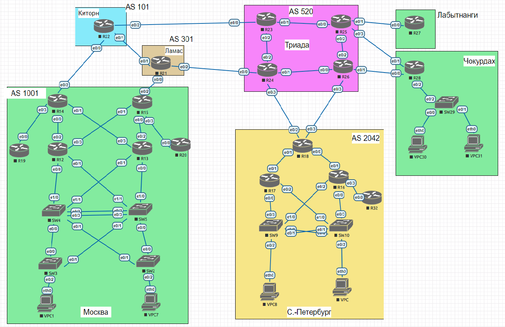

# Планирование адресного пространства. IPv4/6

#### Цель:
В данной самостоятельной работе необходимо распланировать адресное пространство.<br>
Настроить IP на всех активных портах для дальнейшей работы над проектом.<br>
Адресное пространство должно быть задокументировано.<br>

#### Описание/Пошаговая инструкция выполнения домашнего задания:

В этой самостоятельной работе мы ожидаем, что вы самостоятельно:

1) Разработаете и задокументируете адресное пространство для лабораторного стенда.
2) Настроите IP адреса на каждом активном порту.
3) Настроите каждый VPC в каждом офисе в своем VLAN.
4) Настроите VLAN управления для сетевых устройств. 
5) Настроите сети офисов так, чтобы не возникало broadcast штормов, а использование линков было максимально оптимизировано.

### 1. Разработаете и задокументируете адресное пространство для лабораторного стенда.



### 2. Настроите ip адреса на каждом активном порту

#### Москва AS 1001

| Device | Interface | IP Address | Subnet Mask | Default Gateway | VLAN |
|--------|-----------|------------|-------------|-----------------|------|
| SW2    | vlan 100  | 10.16.10.2 | 255.255.255.0 | N/A           | 100  |
| SW2    | e0/2      | N/A        | N/A         | N/A             | 17   |
| SW3    | vlan 100  | 10.16.10.3 | 255.255.255.0 | N/A           | 100  |
| SW3    | e0/2      | N/A        | N/A         | N/A             | 11   |
| SW4    | vlan 100  | 10.16.10.4 | 255.255.255.0 | N/A           | 100  |
| SW5    | vlan 100  | 10.16.10.5 | 255.255.255.0 | N/A           | 100  |
| R12    | Loopback  | 10.0.0.12  | 255.255.255.0 | N/A           | N/A  |
| R12    | e0/2      | 10.16.4.1  | 255.255.255.0 | N/A           | N/A  |
| R12    | e0/3      | 10.16.6.1  | 255.255.255.0 | N/A           | N/A  |
| R12    | e0/0.11   | 10.16.2.12 | 255.255.255.0 | N/A           | 11   |
| R12    | e0/0.11 VRRP Gr11 | 10.16.2.126 | N/A     | N/A           | 11   |
| R12    | e0/0.17 VRRP Gr17 | 10.16.3.126 | N/A     | N/A           | 17   |
| R12    | e0/0.100  | 10.16.10.30 | 255.255.255.0 | N/A         | 100  |
| R12    | e0/1.17   | 10.16.3.12 | 255.255.255.0 | N/A           | 17   |
| R13    | Loopback  | 10.0.0.13  | 255.255.255.0 | N/A           | N/A  |
| R13    | e0/3      | 10.16.5.1  | 255.255.255.0 | N/A           | N/A  |
| R13    | e0/2      | 10.16.7.1  | 255.255.255.0 | N/A           | N/A  |
| R13    | e0/0.11   | 10.16.2.13 | 255.255.255.0 | N/A           | 11   |
| R13    | e0/0.11 VRRP Gr11 | 10.16.2.126 | N/A     | N/A           | 11   |
| R13    | e0/1.17   | 10.16.3.13 | 255.255.255.0 | N/A           | 17   |
| R13    | e0/1.17 VRRP Gr17 | 10.16.3.126 | N/A     | N/A           | 17   |
| R13    | e0/0.100  | 10.16.10.31 | 255.255.255.0 | N/A         | 100  |
| R14    | Loopback  | 10.0.0.14  | 255.255.255.0 | N/A           | N/A  |
| R14    | e0/0      | 10.16.4.2  | 255.255.255.0 | N/A           | N/A  |
| R14    | e0/1      | 10.16.5.2  | 255.255.255.0 | N/A           | N/A  |
| R14    | e0/3      | 10.16.9.2  | 255.255.255.0 | N/A           | N/A  |
| R14    | e0/2      | 10.17.1.4  | 255.255.255.0 | N/A           | N/A  |
| R15    | Loopback  | 10.0.0.15  | 255.255.255.0 | N/A           | N/A  |
| R15    | e0/1      | 10.16.6.2  | 255.255.255.0 | N/A           | N/A  |
| R15    | e0/0      | 10.16.7.2  | 255.255.255.0 | N/A           | N/A  |
| R15    | e0/3      | 10.16.8.2  | 255.255.255.0 | N/A           | N/A  |
| R15    | e0/2      | 10.18.1.2  | 255.255.255.0 | N/A           | N/A  |
| R20    | Loopback  | 10.0.0.20  | 255.255.255.0 | N/A           | N/A  |
| R20    | e0/0      | 10.16.8.1  | 255.255.255.0 | N/A           | N/A  |
| R19    | Loopback  | 10.0.0.19  | 255.255.255.0 | N/A           | N/A  |
| R19    | e0/0      | 10.16.9.1  | 255.255.255.0 | N/A           | N/A  |
| VPC1   | NIC       | 10.16.2.11 | 255.255.255.0 | 10.16.2.126   | 11   |
| VPC7   | NIC       | 10.16.3.17 | 255.255.255.0 | 10.16.3.126   | 17   |

#### Санкт - Петербург
|  Device |Interface   |  IP Address | Subnet Mask  |  Default Gateway | VLAN |
| ------------ | ------------ | ------------ | ------------ | ------------ | ------------ |
| SW9  |VLAN 101  |  10.30.101.9  | 255.255.255.0 |  N/A | 101|
| SW9  |e0/2  |  N/A  | N/A |  N/A | 38|
| SW10  |VLAN 101  |  10.30.101.10  | 255.255.255.0 |  N/A | 101|
| SW10  |e0/2  |  N/A  | N/A |  N/A | 2|
| VPC8  |NIC  |  10.30.38.8  | 255.255.255.0 |  10.30.38.126 | 38|
| VPC  |NIC  |  10.30.31.2  | 255.255.255.0 |  10.30.31.126 | 2|
| R17  |Loopback  |  10.0.0.17  | 255.255.255.0 |  N/A | N/A|
| R17  |e0/0.101  |  10.30.101.17  | 255.255.255.0 |  N/A | 101|
| R17  |e0/0.38  |  10.30.38.17  | 255.255.255.0 |  N/A | 38|
| R17  |e0/2.2  |  10.30.31.17  | 255.255.255.0 |  N/A | 2|
| R17  |e0/1  |  10.30.17.1  | 255.255.255.0 |  N/A | N/A|
| R17  |e0/0.38 VRRP Gr38  |  10.30.38.126  | N/A |  N/A | 38|
| R17  |e0/0.2 VRRP Gr2  |  10.30.31.126  | N/A |  N/A | 2|
| R16  |Loopback  |  10.0.0.16  | 255.255.255.0 |  N/A | N/A|
| R16  |e0/0.101  |  10.30.101.16  | 255.255.255.0 |  N/A | 101|
| R16  |e0/0.38  |  10.30.38.16  | 255.255.255.0 |  N/A | 38|
| R16  |e0/2.2  |  10.30.31.16  | 255.255.255.0 |  N/A | 2|
| R16  |e0/1  |  10.30.16.1  | 255.255.255.0 |  N/A | N/A|
| R16  |e0/1  |   10.30.16.1  | 255.255.255.0 |  N/A | N/A|
| R16  |e0/3  |  10.30.32.1  | 255.255.255.0 |  N/A | N/A|
| R16  |e0/0.38 VRRP Gr38  |  10.30.38.126  | N/A |  N/A | 38|
| R16  |e0/0.2 VRRP Gr2  |  10.30.31.126  | N/A |  N/A | 2|
| R18  |Loopback  |  10.0.0.18  | 255.255.255.0 |  N/A | N/A|
| R18  |e0/0  |  10.30.16.2  | 255.255.255.0 |  N/A | N/A|
| R18  |e0/1  |  10.30.17.2  | 255.255.255.0 |  N/A | N/A|
| R18  |e0/2  |  10.19.3.2  | 255.255.255.0 |  N/A | N/A|
| R18  |e0/3  |  10.19.5.2  | 255.255.255.0 |  N/A | N/A|
| R32  |Loopback  |  10.0.0.32  | 255.255.255.0 |  N/A | N/A|
| R32  |e0/0  |  10.30.32.2  | 255.255.255.0 |  N/A | N/A|

#### Триада AS 520
|  Device |Interface   |  IP Address | Subnet Mask  |  Default Gateway | VLAN |
| ------------ | ------------ | ------------ | ------------ | ------------ | ------------ |
| R23  |e0/0  |  10.17.3.2  | 255.255.255.0 |  N/A | N/A|
| R23  |e0/1  |  10.19.2.1  | 255.255.255.0 |  N/A | N/A|
| R23  |e0/2  |  10.19.1.1  | 255.255.255.0 |  N/A | N/A|
| R23  |Loopback  |  10.0.0.23  | 255.255.255.0 |  N/A | N/A|
| R24  |Loopback  |  10.0.0.24  | 255.255.255.0 |  N/A | N/A|
| R24  |e0/0  |  10.18.3.2  | 255.255.255.0 |  N/A | N/A|
| R24  |e0/3  |  10.19.3.1  | 255.255.255.0 |  N/A | N/A|
| R24  |e0/1  |  10.19.4.1  | 255.255.255.0 |  N/A | N/A|
| R24  |e0/2  |   10.19.1.2  | 255.255.255.0 |  N/A | N/A|
| R26  |e0/0  |  10.19.4.2  | 255.255.255.0 |  N/A | N/A|
| R26  |Loopback  |  10.0.0.26  | 255.255.255.0 |  N/A | N/A|
| R26  |e0/3  |  10.19.5.1  | 255.255.255.0 |  N/A | N/A|
| R26  |e0/1  |  10.19.6.1  | 255.255.255.0 |  N/A | N/A|
| R26  |e0/2  |  10.19.7.1  | 255.255.255.0 |  N/A | N/A|
| R25  |e0/0  |  10.19.2.2  | 255.255.255.0 |  N/A | N/A|
| R25  |e0/1  |  10.19.9.1  | 255.255.255.0 |  N/A | N/A|
| R25  |e0/2  |  10.19.7.2  | 255.255.255.0 |  N/A | N/A|
| R25  |e0/3  |  10.19.8.1  | 255.255.255.0 |  N/A | N/A|

#### Киторн AS 101
|  Device |Interface   |  IP Address | Subnet Mask  |  Default Gateway | VLAN |
| ------------ | ------------ | ------------ | ------------ | ------------ | ------------ |
| R22  |e0/0  |  10.17.1.1  | 255.255.255.0 |  N/A | N/A|
| R22  |e0/1  |  10.17.2.1  | 255.255.255.0 |  N/A | N/A|
| R22  |e0/2  |  10.17.3.1  | 255.255.255.0 |  N/A | N/A|
| R22  |Loopback  |  10.0.0.22  | 255.255.255.0 |  N/A | N/A|

#### Ламас AS 301
|  Device |Interface   |  IP Address | Subnet Mask  |  Default Gateway | VLAN |
| ------------ | ------------ | ------------ | ------------ | ------------ | ------------ |
| R21  |e0/0  |  10.18.1.1  | 255.255.255.0 |  N/A | N/A|
| R21  |e0/1  |  10.17.2.2  | 255.255.255.0 |  N/A | N/A|
| R21  |e0/2  |  10.18.3.1  | 255.255.255.0 |  N/A | N/A|
| R21  |Loopback  |  10.0.0.21  | 255.255.255.0 |  N/A | N/A|

#### Лабытнаги
|  Device |Interface   |  IP Address | Subnet Mask  |  Default Gateway | VLAN |
| ------------ | ------------ | ------------ | ------------ | ------------ | ------------ |
| R27  |Loopback  |  10.19.9.2  | 255.255.255.0 |  N/A | N/A|
| R27  |e0/0  |  10.0.0.27  | 255.255.255.0 |  N/A | N/A|

#### Чокурдах
|  Device |Interface   |  IP Address | Subnet Mask  |  Default Gateway | VLAN |
| ------------ | ------------ | ------------ | ------------ | ------------ | ------------ |
| VPC30  |NIC  |  10.20.30.30  | 255.255.255.0 |  10.20.30.1 | 30|
| VPC31  |NIC  |  10.20.31.31  | 255.255.255.0 |  10.20.31.1 | 31|
| SW29  |VLAN 29  |  10.20.29.29  | 255.255.255.0 |  N/A | 29|
| SW29  |e0/0  |  N/A | N/A |  N/A | 30|
| SW29  |e0/1  |  N/A | N/A |  N/A | 31|
| R28  |e0/0  |  10.19.6.2  | 255.255.255.0 |  N/A | N/A|
| R28  |e0/1  |  10.19.8.2  | 255.255.255.0 |  N/A | N/A|
| R28  |Loopback  |  10.0.0.27  | 255.255.255.0 |  N/A | N/A|
| R28  |e0/2.30  |  10.20.30.1  | 255.255.255.0 |  N/A | 30|
| R28  |e0/2.31  |  10.20.31.1  | 255.255.255.0 |  N/A | 31|
| R28  |e0/2.29  |  10.20.29.1  | 255.255.255.0 |  N/A | 29|


### 3. Настроите каждый VPC в каждом офисе в своем VLAN.

Выполнено на каждом VPC в соответствии с адресным пространством.
VPC7

```
pcname VPC7
ip 10.16.3.17 255.255.255.0 10.16.3.126
```

```
SW2(config)#interface vlan 17
SW2(config)#interface ethernet 0/2
SW2(config-if)#description Link ti VPC7
SW2(config-if)#switchport mode access
SW2(config-if)#switchport access vlan 17
```

4.Настроите VLAN/Loopbackup interface управления для сетевых устройств

Настроите VLAN/Loopbackup interface управления для сетевых устройств

Настройка loopback, выполнено на всех маршрутизаторах.

```
R13(config)#interface loopback 0
R13(config-if)#ip address 10.0.0.13 255.255.255.0
```

Настройка vlan управления для sw2, выполенно на каждом коммутаторе в соответствии с адресным пространством.

```
VLAN 100
interface vlan 100
ip address 10.16.10.22 255.255.255.0
description mgmt
no shutdown
```

5.Настроите сети офисов так, чтобы не возникало broadcast штормов, а использование линков было максимально оптимизировано

Активирован STP и транковые порты для соответствующих VLAN всех локаций
Настройка на коммутаторах пример с SW5 - SW4

```
SW5#show spanning-tree

VLAN0011
  Spanning tree enabled protocol ieee
  Root ID    Priority    32779
             Address     aabb.cc00.2000
             Cost        100
             Port        1 (Ethernet0/0)
             Hello Time   2 sec  Max Age 20 sec  Forward Delay 15 sec

  Bridge ID  Priority    32779  (priority 32768 sys-id-ext 11)
             Address     aabb.cc00.5000
             Hello Time   2 sec  Max Age 20 sec  Forward Delay 15 sec
             Aging Time  300 sec

Interface           Role Sts Cost      Prio.Nbr Type
------------------- ---- --- --------- -------- --------------------------------
Et0/0               Root FWD 100       128.1    Shr
Et0/1               Desg FWD 100       128.2    Shr
Et1/0               Desg FWD 100       128.5    Shr
Et1/1               Desg FWD 100       128.6    Shr


VLAN0017
  Spanning tree enabled protocol ieee
  Root ID    Priority    32785
             Address     aabb.cc00.2000
             Cost        100
             Port        1 (Ethernet0/0)
             Hello Time   2 sec  Max Age 20 sec  Forward Delay 15 sec

  Bridge ID  Priority    32785  (priority 32768 sys-id-ext 17)
             Address     aabb.cc00.5000
             Hello Time   2 sec  Max Age 20 sec  Forward Delay 15 sec
             Aging Time  300 sec

Interface           Role Sts Cost      Prio.Nbr Type
------------------- ---- --- --------- -------- --------------------------------
Et0/0               Root FWD 100       128.1    Shr
Et0/1               Desg FWD 100       128.2    Shr
Et1/0               Desg FWD 100       128.5    Shr
Et1/1               Desg FWD 100       128.6    Shr


VLAN0100
  Spanning tree enabled protocol ieee
  Root ID    Priority    32868
             Address     aabb.cc00.2000
             Cost        100
             Port        1 (Ethernet0/0)
             Hello Time   2 sec  Max Age 20 sec  Forward Delay 15 sec

  Bridge ID  Priority    32868  (priority 32768 sys-id-ext 100)
             Address     aabb.cc00.5000
             Hello Time   2 sec  Max Age 20 sec  Forward Delay 15 sec
             Aging Time  300 sec

Interface           Role Sts Cost      Prio.Nbr Type
------------------- ---- --- --------- -------- --------------------------------
Et0/0               Root FWD 100       128.1    Shr
Et0/1               Desg FWD 100       128.2    Shr
Et1/0               Desg FWD 100       128.5    Shr
Et1/1               Desg FWD 100       128.6    Shr 
```

```
SW4#show interfaces trunk

Port        Mode             Encapsulation  Status        Native vlan
Et0/0       on               802.1q         trunking      1
Et0/1       on               802.1q         trunking      1
Et0/2       on               802.1q         trunking      1
Et0/3       on               802.1q         trunking      1
Et1/0       on               802.1q         trunking      1
Et1/1       on               802.1q         trunking      1

Port        Vlans allowed on trunk
Et0/0       11,17,100
Et0/1       11,17,100
Et0/2       11,17,100
Et0/3       11,17,100
Et1/0       11,17,100
Et1/1       11,17,100

Port        Vlans allowed and active in management domain
Et0/0       11,17,100
Et0/1       11,17,100
Et0/2       11,17,100
Et0/3       11,17,100
Et1/0       11,17,100
Et1/1       11,17,100

Port        Vlans in spanning tree forwarding state and not pruned
Et0/0       11,17,100
Et0/1       11,17,100
Et0/2       11,17,100
Et0/3       11,17,100
Et1/0       11,17,100
Et1/1       11,17,100
```

Настройка VRRP
R12 и R13 для vlan 11
Аналогично был настроен vrrp для vlan 17 на ethernet 0/1.17
Так же был настроен vrrp для R17/R16

```
R12(config)# interface ethernet 0/0.11
R12(config-if)# vrrp 11 priority 110 
R12(config-if)# ip address 10.16.2.12 255.255.255.0
R12(config-if)# vrrp 11 authentication cisco
R12(config-if)# vrrp 11 timers advertise 3 
R12(config-if)# vrrp 11 timers learn 
R12(config-if)# vrrp 11 ip 10.16.2.126
```

```
R13(config)# interface ethernet 0/0.11
R13(config-if)# ip address 10.16.2.13 255.255.255.0
R13(config-if)# vrrp 11 priority 100
R13(config-if)# vrrp 11 authentication cisco 
R13(config-if)# vrrp 11 timers advertise 3 
R13(config-if)# vrrp 11 timers learn
R13(config-if)# vrrp 11 ip 10.16.2.126
```

Настроен IP SLA для резервных маршрутов между роутерами учитывающий ноды VRRP
Первый маршрут через 10.16.4.1 (основной)
Второй 10.16.5.1   (менее приоритетный)


```
R14(config)#ip sla 1
R14(config-ip-sla)#icmp-echo 10.16.4.1 source-interface ethernet 0/0
R14(config-ip-sla-echo)#threshold 2
R14(config-ip-sla-echo)#timeout 1000
R14(config-ip-sla-echo)#frequency 3
R14(config-ip-sla-echo)#exit
R14(config)#ip sla schedule 1 life forever start-time now
track 1 ip sla 1 reachability
```

ip route 10.16.2.0 255.255.255.0 10.16.4.1 50 track 1 (указываем более высокую метрику 50 и вешаем track 1,т.е. когда 10.16.4.1 доступен машрут появляется в таблице маршрутизации и перекрывает более низкий,если ляжет он пропадет из таблицы)

ip route 10.16.2.0 255.255.255.0 10.16.5.1 100  (указываем более низкий приоритет метрики 100)
Аналогично настроен ip sla для VRRP в Санкт - Петербург