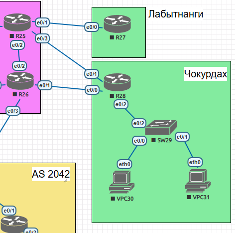

## PBR

### Цель:
Настроить политику маршрутизации в офисе Чокурдах. Распределить трафик между 2 линками.

### Описание домашнего задания:
В этой самостоятельной работе мы ожидаем, что вы самостоятельно:

1. Настроите политику маршрутизации для сетей офиса Чокурдах.
2. Распределите трафик между двумя линками с провайдером (только для IPv4).
3. Настроите отслеживание линка через технологию **IP SLA**.
4. Настройте для офиса Лабытнанги маршрут по-умолчанию.

### Схема  
  
### 1. Настроены VLAN и транки на всех портах в соответствии с таблицей адресации.

```
interface Loopback0
 ip address 10.0.0.28 255.255.255.0
!
interface Ethernet0/0
 description Link to R26
 ip address 10.19.6.2 255.255.255.0
!
interface Ethernet0/1
 description Link to R25
 ip address 10.19.8.2 255.255.255.0
!
interface Ethernet0/2
 description Trunk link to SW29
 no ip address
!
interface Ethernet0/2.29
 description Default Gateway for VLAN 29
 encapsulation dot1Q 29
 ip address 10.20.29.1 255.255.255.0
!
interface Ethernet0/2.30
 description Default Gateway for VLAN 30
 encapsulation dot1Q 30
 ip address 10.20.30.1 255.255.255.0
!
interface Ethernet0/2.31
 description Default Gateway for VLAN 31
 encapsulation dot1Q 31
 ip address 10.20.31.1 255.255.255.0
```
### 2. Создан route-map для подсети каждого VPC

```
R28(config)#ip access-list extended 130
R28(config-ext-nacl)#permit ip 10.20.30.0 0.0.0.255 any
R28(config)#ip access-list extended 131
R28(config-ext-nacl)#permit ip 10.20.31.0 0.0.0.255 any
R28(config)#route-map PBR-MAP permit 130
R28(config-route-map)#match ip address 130
R28(config-route-map)#set ip next-hop 10.19.8.1
R28(config-route-map)#exit
R28(config)#route-map PBR-MAP permit 131
R28(config-route-map)#match ip address 131
R28(config-route-map)#set ip next-hop 10.19.6.1
R28(config-route-map)#exit
R28(config)#interface ethernet 0/2.30
R28(config-if)#ip policy route-map PBR-MAP
R28(config)#interface ethernet 0/2.31
R28(config-if)#ip policy route-map PBR-MAP
```

Проверяем доступность хоста за "провайдерами" от VPC

```
VPC30> trace 10.19.2.1
trace to 10.19.2.1, 8 hops max, press Ctrl+C to stop
 1   10.20.30.1   0.256 ms  0.234 ms  0.299 ms
 2   10.19.8.1   0.492 ms  0.359 ms  0.323 ms
 3   *10.19.2.1   0.501 ms (ICMP type:3, code:3, Destination port unreachable)  *
```

```
 VPC31> trace 10.19.2.1
trace to 10.19.2.1, 8 hops max, press Ctrl+C to stop
 1   10.20.31.1   0.214 ms  0.151 ms  0.190 ms
 2   10.19.6.1   0.286 ms  0.330 ms  0.250 ms
 3   *10.19.6.1   0.458 ms (ICMP type:3, code:1, Destination host unreachable)  *
```
 
 Видно, что политика PBR работает.
 
 ```
 R28#show  route-map
route-map PBR-MAP, permit, sequence 130
  Match clauses:
    ip address (access-lists): 130
  Set clauses:
    ip next-hop 10.19.8.1
  Policy routing matches: 9 packets, 978 bytes
route-map PBR-MAP, permit, sequence 131
  Match clauses:
    ip address (access-lists): 131
  Set clauses:
    ip next-hop 10.19.6.1
  Policy routing matches: 9 packets, 978 bytes
```

### 3. Настроено отслеживание линка через технологию IP SLA.

```
R28(config)#ip sla 1
R28(config-ip-sla)#icmp-echo 10.19.8.1 source-interface et
R28(config-ip-sla)#icmp-echo 10.19.8.1 source-interface ethernet 0/1
R28(config-ip-sla-echo)#threshold 2
R28(config-ip-sla-echo)#timeout 1000
R28(config-ip-sla-echo)#frequency 3
R28(config-ip-sla-echo)#exit
R28(config)#ip sla schedule 1 life forever start-time now
R28(config)#track 1 ip sla 1 reachability
R28(config-track)#exit
R28(config)#ip route 0.0.0.0 0.0.0.0 10.19.8.1 50 track 1
R28(config)#ip route 0.0.0.0 0.0.0.0 10.19.6.1 100
R28(config)#exit
```


### 4. Настройте для офиса Лабытнанги маршрут по-умолчанию.

```
R27(config)#interface ethernet 0/0
R27(config-if)#description Link to R25
R27(config-if)#ip address 10.19.9.2 255.255.255.0
R27(config-if)#no shutdown
R27(config-if)#ip route 0.0.0.0 0.0.0.0 10.19.9.1
R27(config)#end
```