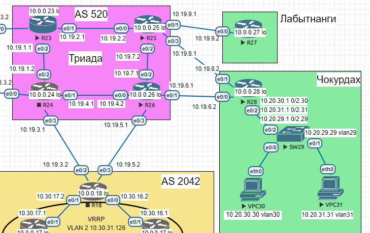

## PBR

### Цель:
Настроить политику маршрутизации в офисе Чокурдах. Распределить трафик между 2 линками.

### Описание домашнего задания:
В этой самостоятельной работе мы ожидаем, что вы самостоятельно:

1. Настроите политику маршрутизации для сетей офиса Чокурдах.
2. Распределите трафик между двумя линками с провайдером (только для IPv4).
3. Настроите отслеживание линка через технологию **IP SLA**.
4. Настройте для офиса Лабытнанги маршрут по-умолчанию.

### Схема  
  
______  
### Часть 1. Настройте политику маршрутизации для сетей офиса.   
Политика маршрутизации была настроена в виде маршрутов по умолчанию от R28 к R25, R26 с разной административной дистанцией.  
```
R28(config)#do sh run | i ip route
ip route 0.0.0.0 0.0.0.0 50.50.1.17 20
ip route 0.0.0.0 0.0.0.0 50.50.1.21 21
```
Также были настроены обратные маршруты от марщрутизаторов R26 и R25 соответственно, и настроена связь между ними:
```
R26(config)#ip route 0.0.0.0 0.0.0.0 50.50.1.18 20
R26(config)#ip route 0.0.0.0 0.0.0.0 10.10.2.5 21
```
```
R25(config)#ip route 0.0.0.0 0.0.0.0 50.50.1.22 20
R25(config)#ip route 0.0.0.0 0.0.0.0 10.10.2.6 21
```
### Часть 2. Распределите трафик между двумя линками с провайдером. 
В данном пункте предпологается что трафик от VPC30 будет направлен к R26, а трафик от VPC31 к R25.  
Для реализации данной задачи необходимо произвести следующие настройки на маршрутизаторе R28:
1. Создаем ACL соответстввенно сетям VLAN VPC:
```
R28(config)#do sh access-lists
Standard IP access list VLAN_31
    10 permit 10.3.3.0, wildcard bits 0.0.0.15
Standard IP access list VLAN_32
    10 permit 10.3.3.16, wildcard bits 0.0.0.15
```
2. Настраиваем PBR соответственно условию:  
```
R28#sh route-map
route-map PBR, permit, sequence 10
  Match clauses:
    ip address (access-lists): VLAN_31
  Set clauses:
    ip next-hop 50.50.1.17
  Policy routing matches: 0 packets, 0 bytes
route-map PBR, permit, sequence 20
  Match clauses:
    ip address (access-lists): VLAN_32
  Set clauses:
    ip next-hop 50.50.1.21
  Policy routing matches: 0 packets, 0 bytes
```
3. Применяем созданный route map к саб интерфейсу направленному на VPC30 и VPC31:  
```
interface Ethernet0/2
 no ip address
!
interface Ethernet0/2.30
 description gate vlan30
 encapsulation dot1Q 30
 ip address 10.3.1.9 255.255.255.248
!
interface Ethernet0/2.31
 description gate vlan31
 encapsulation dot1Q 31
 ip address 10.3.3.1 255.255.255.240
ip policy route-map PBR
!
interface Ethernet0/2.32
 description gate vlan32
 encapsulation dot1Q 32
 ip address 10.3.3.17 255.255.255.240
ip policy route-map PBR
!
```
4. Для проверки выполним трассировку с VPC30 и VPC31:

VPC30:
```
VPCS> trace 10.10.2.5
trace to 10.10.2.5, 8 hops max, press Ctrl+C to stop
 1   10.3.3.1   2.072 ms  2.690 ms  2.115 ms
 2   50.50.1.17   1.521 ms  0.988 ms  1.135 ms
 3   *10.10.2.5   1.385 ms (ICMP type:3, code:3, Destination port unreachable)  *
```
VPC31:
```
VPCS> trace  10.10.2.6
trace to 10.10.2.6, 8 hops max, press Ctrl+C to stop
 1   10.3.3.17   0.519 ms  0.482 ms  0.615 ms
 2   50.50.1.21   3.047 ms  2.608 ms  2.841 ms
 3   *10.10.2.6   2.563 ms (ICMP type:3, code:3, Destination port unreachable)
```
### Часть 3. Настройте отслеживание линка через технологию IP SLA. 
Для выполнения этого задания был выбран линк между R28 и R26.
Настройка отслеживания:
```
ip sla 1
 icmp-echo 50.50.1.17 source-ip 50.50.1.18
ip sla schedule 1 life forever start-time now
```
Создаем обьект отслеживания:
```
track 1 ip sla 1 reachability
 delay down 10 up 10
```
И вешаем его на маршрут по умолчанию:
```
ip route 0.0.0.0 0.0.0.0 50.50.1.17 20 track 1
ip route 0.0.0.0 0.0.0.0 50.50.1.21 21
```
Cтатистика SLA:
```
R28#sh ip sla statistics
IPSLAs Latest Operation Statistics

IPSLA operation id: 1
        Latest RTT: 1 milliseconds
Latest operation start time: 15:10:47 UTC Mon Dec 11 2024
Latest operation return code: OK
Number of successes: 9
Number of failures: 0
Operation time to live: Forever
```
При отключение линка со стороны R26: 
```
R28#sh ip sla statistics
IPSLAs Latest Operation Statistics

IPSLA operation id: 1
        Latest RTT: NoConnection/Busy/Timeout
Latest operation start time: 15:10:47 UTC Mon Dec 11 2024
Latest operation return code: Timeout
Number of successes: 11
Number of failures: 1
Operation time to live: Forever


R28#
*Dec 11 15:10:47.118: %TRACK-6-STATE: 1 ip sla 1 reachability Up -> Down
```
### Часть 4. Настройте для офиса Лабытнанги маршрут по-умолчанию.
Настройка маршрута по умолчанию для офиса Лабытнанги(R27):
```
R27(config)#do sh ip route
Codes: L - local, C - connected, S - static, R - RIP, M - mobile, B - BGP
       D - EIGRP, EX - EIGRP external, O - OSPF, IA - OSPF inter area
       N1 - OSPF NSSA external type 1, N2 - OSPF NSSA external type 2
       E1 - OSPF external type 1, E2 - OSPF external type 2
       i - IS-IS, su - IS-IS summary, L1 - IS-IS level-1, L2 - IS-IS level-2
       ia - IS-IS inter area, * - candidate default, U - per-user static route
       o - ODR, P - periodic downloaded static route, H - NHRP, l - LISP
       a - application route
       + - replicated route, % - next hop override

Gateway of last resort is 50.50.1.25 to network 0.0.0.0

S*    0.0.0.0/0 [1/0] via 50.50.1.25
      10.0.0.0/8 is variably subnetted, 2 subnets, 2 masks
C        10.3.1.0/29 is directly connected, Loopback1
L        10.3.1.3/32 is directly connected, Loopback1
      50.0.0.0/8 is variably subnetted, 2 subnets, 2 masks
C        50.50.1.24/30 is directly connected, Ethernet0/0
L        50.50.1.26/32 is directly connected, Ethernet0/0
```