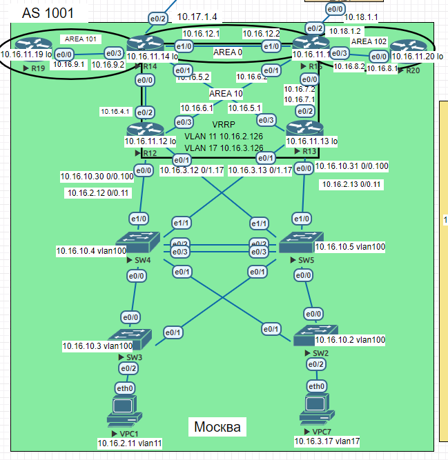

## OSPF

### Цель:
Настроить OSPF офисе Москва.  
Разделить сеть на зоны.  
Настроить фильтрацию между зонами.  

### Описание/Пошаговая инструкция выполнения домашнего задания:

1. Маршрутизаторы R14-R15 находятся в зоне 0 - backbone.
2. Маршрутизаторы R12-R13 находятся в зоне 10. Дополнительно к маршрутам должны получать маршрут по умолчанию.
3. Маршрутизатор R19 находится в зоне 101 и получает только маршрут по умолчанию.
4. Маршрутизатор R20 находится в зоне 102 и получает все маршруты, кроме маршрутов до сетей зоны 101.

### Схема  
  

### 1. Маршрутизаторы R14-R15 в зоне 0 (backbone):

Внешние интерфейсы R14-R15 переведены в пассивный режим OSPF.

На маршрутизаторе R15 временно назначен маршрут по умолчанию (до установления BGP с провайдерами) "ip route 0.0.0.0 0.0.0.0 10.18.1.1",чтобы проверить работу default-information originate.
Настроена фильтрация маршрута зоны 102 (исключен 10.16.9.0/24, зона 101)

```
R14
router ospf 1
 area 101 stub no-summary
 network 10.16.4.0 0.0.0.255 area 10
 network 10.16.5.0 0.0.0.255 area 10
 network 10.16.9.0 0.0.0.255 area 101
 network 10.16.10.0 0.0.0.255 area 0
 passive-interface default
 no passive-interface ethernet 0/0
 no passive-interface ethernet 0/1
 no passive-interface ethernet 0/3
 no passive-interface ethernet 1/0
```

```
R15
router ospf 1
 network 10.16.6.0 0.0.0.255 area 10
 network 10.16.7.0 0.0.0.255 area 10
 network 10.16.8.0 0.0.0.255 area 102
 network 10.16.12.0 0.0.0.255 area 0
 passive-interface default  
 no passive-interface ethernet 0/0
 no passive-interface ethernet 0/1
 no passive-interface ethernet 0/3
 no passive-interface ethernet 1/0
 default-information originate
ip route 0.0.0.0 0.0.0.0 10.18.1.1
ip prefix-list FILTER-INTO-AREA-102 seq 10 deny 10.16.9.0/24
ip prefix-list FILTER-INTO-AREA-102 seq 20 permit 0.0.0.0/0 le 32
area 102 filter-list prefix FILTER-INTO-AREA-102 in
```

```
R14#show ip ospf database

            OSPF Router with ID (10.16.11.14) (Process ID 1)

                Router Link States (Area 0)

Link ID         ADV Router      Age         Seq#       Checksum Link count
10.0.0.15       10.0.0.15       863         0x80000026 0x00AED0 1
10.16.11.14     10.16.11.14     235         0x80000022 0x00AAA7 1

                Net Link States (Area 0)

Link ID         ADV Router      Age         Seq#       Checksum
10.16.12.2      10.0.0.15       863         0x80000023 0x002B5F

                Summary Net Link States (Area 0)

Link ID         ADV Router      Age         Seq#       Checksum
10.16.2.0       10.0.0.15       863         0x8000001F 0x0008CD
10.16.2.0       10.16.11.14     488         0x8000001F 0x00407B
10.16.3.0       10.0.0.15       863         0x8000001F 0x00FCD7
10.16.3.0       10.16.11.14     488         0x8000001F 0x003585
10.16.4.0       10.0.0.15       863         0x8000001F 0x00F1E1
10.16.4.0       10.16.11.14     488         0x8000001F 0x00C5FD
10.16.5.0       10.0.0.15       863         0x80000020 0x00E4EC
10.16.5.0       10.16.11.14     488         0x80000021 0x00B60A
10.16.6.0       10.0.0.15       1622        0x8000001F 0x007764
10.16.6.0       10.16.11.14     488         0x80000022 0x000EA6
10.16.7.0       10.0.0.15       1622        0x8000001F 0x006C6E
10.16.7.0       10.16.11.14     488         0x80000023 0x0001B1
10.16.8.0       10.0.0.15       1116        0x8000001C 0x006775
10.16.9.0       10.16.11.14     488         0x80000021 0x008A32
10.16.10.0      10.0.0.15       863         0x8000001F 0x00AF1E
10.16.10.0      10.16.11.14     488         0x8000001F 0x00E7CB
10.16.11.12     10.0.0.15       863         0x80000020 0x00CFF8
10.16.11.12     10.16.11.14     488         0x8000001F 0x000AA5
10.16.11.13     10.0.0.15       863         0x80000020 0x00C502
10.16.11.13     10.16.11.14     488         0x80000021 0x00FBB0
10.16.11.19     10.16.11.14     488         0x8000001F 0x00C3E4
10.16.11.20     10.0.0.15       1116        0x8000001C 0x00873D

                Summary ASB Link States (Area 0)

Link ID         ADV Router      Age         Seq#       Checksum
10.0.0.15       10.16.11.14     1243        0x8000001E 0x00744A

                Router Link States (Area 10)

Link ID         ADV Router      Age         Seq#       Checksum Link count
10.0.0.15       10.0.0.15       864         0x8000002B 0x009591 2
10.16.11.12     10.16.11.12     142         0x80000024 0x000F43 6
10.16.11.13     10.16.11.13     505         0x80000027 0x006ED6 6
10.16.11.14     10.16.11.14     235         0x80000024 0x00FC09 2

                Net Link States (Area 10)

Link ID         ADV Router      Age         Seq#       Checksum
10.16.2.13      10.16.11.13     505         0x80000021 0x00213A
10.16.3.13      10.16.11.13     505         0x8000001F 0x001A42
10.16.4.1       10.16.11.12     921         0x8000001F 0x009FC7
10.16.5.1       10.16.11.13     505         0x8000001F 0x0098CB
10.16.6.2       10.0.0.15       864         0x80000023 0x005141
10.16.7.2       10.0.0.15       864         0x80000023 0x00543C
10.16.10.31     10.16.11.13     505         0x8000001F 0x00182B

                Summary Net Link States (Area 10)

Link ID         ADV Router      Age         Seq#       Checksum
10.16.8.0       10.0.0.15       1117        0x8000001C 0x006775
10.16.8.0       10.16.11.14     1243        0x8000001C 0x0004B4
10.16.9.0       10.0.0.15       864         0x8000001F 0x00BA14
10.16.9.0       10.16.11.14     488         0x80000021 0x008A32
10.16.11.19     10.0.0.15       607         0x8000001F 0x00EFC8
10.16.11.19     10.16.11.14     488         0x8000001F 0x00C3E4
10.16.11.20     10.0.0.15       1117        0x8000001C 0x00873D
10.16.11.20     10.16.11.14     1243        0x8000001C 0x00247C
10.16.12.0      10.0.0.15       1623        0x8000001F 0x0035A0
10.16.12.0      10.16.11.14     488         0x80000021 0x006950

                Summary ASB Link States (Area 10)

Link ID         ADV Router      Age         Seq#       Checksum
10.0.0.15       10.16.11.14     1243        0x8000001E 0x0010B8

                Router Link States (Area 101)

Link ID         ADV Router      Age         Seq#       Checksum Link count
10.16.11.14     10.16.11.14     488         0x80000023 0x0092C5 1
10.16.11.19     10.16.11.19     354         0x80000021 0x007B8D 2

                Net Link States (Area 101)

Link ID         ADV Router      Age         Seq#       Checksum
10.16.9.2       10.16.11.14     488         0x80000021 0x00C691

                Summary Net Link States (Area 101)

Link ID         ADV Router      Age         Seq#       Checksum
0.0.0.0         10.16.11.14     488         0x8000001F 0x00F8F3

                Type-5 AS External Link States

Link ID         ADV Router      Age         Seq#       Checksum Tag
0.0.0.0         10.0.0.15       863         0x8000001E 0x004C30 1
```

```
R14#show ip route
Codes: L - local, C - connected, S - static, R - RIP, M - mobile, B - BGP
       D - EIGRP, EX - EIGRP external, O - OSPF, IA - OSPF inter area
       N1 - OSPF NSSA external type 1, N2 - OSPF NSSA external type 2
       E1 - OSPF external type 1, E2 - OSPF external type 2
       i - IS-IS, su - IS-IS summary, L1 - IS-IS level-1, L2 - IS-IS level-2
       ia - IS-IS inter area, * - candidate default, U - per-user static route
       o - ODR, P - periodic downloaded static route, H - NHRP, l - LISP
       a - application route
       + - replicated route, % - next hop override

Gateway of last resort is 10.17.1.1 to network 0.0.0.0

S*    0.0.0.0/0 [1/0] via 10.17.1.1
      10.0.0.0/8 is variably subnetted, 22 subnets, 2 masks
O        10.16.2.0/24 [110/20] via 10.16.5.1, 16:55:51, Ethernet0/1
                      [110/20] via 10.16.4.1, 16:22:02, Ethernet0/0
O        10.16.3.0/24 [110/20] via 10.16.5.1, 16:55:51, Ethernet0/1
                      [110/20] via 10.16.4.1, 16:55:51, Ethernet0/0
C        10.16.4.0/24 is directly connected, Ethernet0/0
L        10.16.4.2/32 is directly connected, Ethernet0/0
C        10.16.5.0/24 is directly connected, Ethernet0/1
L        10.16.5.2/32 is directly connected, Ethernet0/1
O        10.16.6.0/24 [110/20] via 10.16.4.1, 16:55:51, Ethernet0/0
O        10.16.7.0/24 [110/20] via 10.16.5.1, 16:55:51, Ethernet0/1
O IA     10.16.8.0/24 [110/20] via 10.16.12.2, 15:26:03, Ethernet1/0
C        10.16.9.0/24 is directly connected, Ethernet0/3
L        10.16.9.2/32 is directly connected, Ethernet0/3
O        10.16.10.0/24 [110/20] via 10.16.5.1, 16:55:51, Ethernet0/1
                       [110/20] via 10.16.4.1, 16:55:51, Ethernet0/0
C        10.16.11.0/24 is directly connected, Loopback0
O        10.16.11.12/32 [110/11] via 10.16.4.1, 16:55:51, Ethernet0/0
O        10.16.11.13/32 [110/11] via 10.16.5.1, 16:55:51, Ethernet0/1
L        10.16.11.14/32 is directly connected, Loopback0
O        10.16.11.19/32 [110/11] via 10.16.9.1, 16:52:57, Ethernet0/3
O IA     10.16.11.20/32 [110/21] via 10.16.12.2, 15:26:03, Ethernet1/0
C        10.16.12.0/24 is directly connected, Ethernet1/0
L        10.16.12.1/32 is directly connected, Ethernet1/0
C        10.17.1.0/24 is directly connected, Ethernet0/2
L        10.17.1.4/32 is directly connected, Ethernet0/2
```

```
R15#show ip ospf database

            OSPF Router with ID (10.0.0.15) (Process ID 1)

                Router Link States (Area 0)

Link ID         ADV Router      Age         Seq#       Checksum Link count
10.0.0.15       10.0.0.15       1024        0x80000026 0x00AED0 1
10.16.11.14     10.16.11.14     398         0x80000022 0x00AAA7 1

                Net Link States (Area 0)

Link ID         ADV Router      Age         Seq#       Checksum
10.16.12.2      10.0.0.15       1024        0x80000023 0x002B5F

                Summary Net Link States (Area 0)

Link ID         ADV Router      Age         Seq#       Checksum
10.16.2.0       10.0.0.15       1024        0x8000001F 0x0008CD
10.16.2.0       10.16.11.14     651         0x8000001F 0x00407B
10.16.3.0       10.0.0.15       1024        0x8000001F 0x00FCD7
10.16.3.0       10.16.11.14     651         0x8000001F 0x003585
10.16.4.0       10.0.0.15       1024        0x8000001F 0x00F1E1
10.16.4.0       10.16.11.14     651         0x8000001F 0x00C5FD
10.16.5.0       10.0.0.15       1024        0x80000020 0x00E4EC
10.16.5.0       10.16.11.14     651         0x80000021 0x00B60A
10.16.6.0       10.0.0.15       1783        0x8000001F 0x007764
10.16.6.0       10.16.11.14     651         0x80000022 0x000EA6
10.16.7.0       10.0.0.15       1783        0x8000001F 0x006C6E
10.16.7.0       10.16.11.14     651         0x80000023 0x0001B1
10.16.8.0       10.0.0.15       1277        0x8000001C 0x006775
10.16.9.0       10.16.11.14     651         0x80000021 0x008A32
10.16.10.0      10.0.0.15       1024        0x8000001F 0x00AF1E
10.16.10.0      10.16.11.14     651         0x8000001F 0x00E7CB
10.16.11.12     10.0.0.15       1024        0x80000020 0x00CFF8
10.16.11.12     10.16.11.14     651         0x8000001F 0x000AA5
10.16.11.13     10.0.0.15       1024        0x80000020 0x00C502
10.16.11.13     10.16.11.14     651         0x80000021 0x00FBB0
10.16.11.19     10.16.11.14     651         0x8000001F 0x00C3E4
10.16.11.20     10.0.0.15       1277        0x8000001C 0x00873D

                Summary ASB Link States (Area 0)

Link ID         ADV Router      Age         Seq#       Checksum
10.0.0.15       10.16.11.14     1407        0x8000001E 0x00744A

                Router Link States (Area 10)

Link ID         ADV Router      Age         Seq#       Checksum Link count
10.0.0.15       10.0.0.15       1024        0x8000002B 0x009591 2
10.16.11.12     10.16.11.12     304         0x80000024 0x000F43 6
10.16.11.13     10.16.11.13     667         0x80000027 0x006ED6 6
10.16.11.14     10.16.11.14     399         0x80000024 0x00FC09 2

                Net Link States (Area 10)

Link ID         ADV Router      Age         Seq#       Checksum
10.16.2.13      10.16.11.13     667         0x80000021 0x00213A
10.16.3.13      10.16.11.13     667         0x8000001F 0x001A42
10.16.4.1       10.16.11.12     1083        0x8000001F 0x009FC7
10.16.5.1       10.16.11.13     667         0x8000001F 0x0098CB
10.16.6.2       10.0.0.15       1024        0x80000023 0x005141
10.16.7.2       10.0.0.15       1024        0x80000023 0x00543C
10.16.10.31     10.16.11.13     667         0x8000001F 0x00182B

                Summary Net Link States (Area 10)

Link ID         ADV Router      Age         Seq#       Checksum
10.16.8.0       10.0.0.15       1277        0x8000001C 0x006775
10.16.8.0       10.16.11.14     1408        0x8000001C 0x0004B4
10.16.9.0       10.0.0.15       1024        0x8000001F 0x00BA14
10.16.9.0       10.16.11.14     652         0x80000021 0x008A32
10.16.11.19     10.0.0.15       767         0x8000001F 0x00EFC8
10.16.11.19     10.16.11.14     652         0x8000001F 0x00C3E4
10.16.11.20     10.0.0.15       1277        0x8000001C 0x00873D
10.16.11.20     10.16.11.14     1408        0x8000001C 0x00247C
10.16.12.0      10.0.0.15       1783        0x8000001F 0x0035A0
10.16.12.0      10.16.11.14     652         0x80000021 0x006950

                Summary ASB Link States (Area 10)

Link ID         ADV Router      Age         Seq#       Checksum
10.0.0.15       10.16.11.14     1408        0x8000001E 0x0010B8

                Router Link States (Area 102)

Link ID         ADV Router      Age         Seq#       Checksum Link count
10.0.0.15       10.0.0.15       1783        0x80000029 0x005034 1
10.16.11.20     10.16.11.20     1588        0x8000001E 0x002FD9 2

                Net Link States (Area 102)

Link ID         ADV Router      Age         Seq#       Checksum
10.16.8.2       10.0.0.15       1783        0x80000020 0x00B1D9

                Summary Net Link States (Area 102)

Link ID         ADV Router      Age         Seq#       Checksum
10.16.2.0       10.0.0.15       1277        0x8000001C 0x000ECA
10.16.3.0       10.0.0.15       1277        0x8000001C 0x0003D4
10.16.4.0       10.0.0.15       1277        0x8000001C 0x00F7DE
10.16.5.0       10.0.0.15       1277        0x8000001C 0x00ECE8
10.16.6.0       10.0.0.15       1277        0x8000001C 0x007D61
10.16.7.0       10.0.0.15       1277        0x8000001C 0x00726B
10.16.10.0      10.0.0.15       1277        0x8000001C 0x00B51B
10.16.11.12     10.0.0.15       1277        0x8000001C 0x00D7F4
10.16.11.13     10.0.0.15       1277        0x8000001C 0x00CDFD
10.16.11.19     10.0.0.15       1277        0x8000001C 0x00F5C5
10.16.12.0      10.0.0.15       1277        0x8000001C 0x003B9D

                Type-5 AS External Link States

Link ID         ADV Router      Age         Seq#       Checksum Tag
0.0.0.0         10.0.0.15       1024        0x8000001E 0x004C30 1
```

```
R15#show ip route
Codes: L - local, C - connected, S - static, R - RIP, M - mobile, B - BGP
       D - EIGRP, EX - EIGRP external, O - OSPF, IA - OSPF inter area
       N1 - OSPF NSSA external type 1, N2 - OSPF NSSA external type 2
       E1 - OSPF external type 1, E2 - OSPF external type 2
       i - IS-IS, su - IS-IS summary, L1 - IS-IS level-1, L2 - IS-IS level-2
       ia - IS-IS inter area, * - candidate default, U - per-user static route
       o - ODR, P - periodic downloaded static route, H - NHRP, l - LISP
       a - application route
       + - replicated route, % - next hop override

Gateway of last resort is 10.18.1.1 to network 0.0.0.0

S*    0.0.0.0/0 [1/0] via 10.18.1.1
      10.0.0.0/8 is variably subnetted, 22 subnets, 2 masks
O        10.16.2.0/24 [110/20] via 10.16.7.1, 15:12:50, Ethernet0/0
                      [110/20] via 10.16.6.1, 15:12:50, Ethernet0/1
O        10.16.3.0/24 [110/20] via 10.16.7.1, 15:12:50, Ethernet0/0
                      [110/20] via 10.16.6.1, 15:12:50, Ethernet0/1
O        10.16.4.0/24 [110/20] via 10.16.6.1, 15:12:50, Ethernet0/1
O        10.16.5.0/24 [110/20] via 10.16.7.1, 15:12:50, Ethernet0/0
C        10.16.6.0/24 is directly connected, Ethernet0/1
L        10.16.6.2/32 is directly connected, Ethernet0/1
C        10.16.7.0/24 is directly connected, Ethernet0/0
L        10.16.7.2/32 is directly connected, Ethernet0/0
C        10.16.8.0/24 is directly connected, Ethernet0/3
L        10.16.8.2/32 is directly connected, Ethernet0/3
O IA     10.16.9.0/24 [110/20] via 10.16.12.1, 15:12:50, Ethernet1/0
O        10.16.10.0/24 [110/20] via 10.16.7.1, 15:12:50, Ethernet0/0
                       [110/20] via 10.16.6.1, 15:12:50, Ethernet0/1
C        10.16.11.0/24 is directly connected, Loopback0
O        10.16.11.12/32 [110/11] via 10.16.6.1, 15:12:50, Ethernet0/1
O        10.16.11.13/32 [110/11] via 10.16.7.1, 15:12:50, Ethernet0/0
L        10.16.11.15/32 is directly connected, Loopback0
O IA     10.16.11.19/32 [110/21] via 10.16.12.1, 15:12:50, Ethernet1/0
O        10.16.11.20/32 [110/11] via 10.16.8.1, 15:12:50, Ethernet0/3
C        10.16.12.0/24 is directly connected, Ethernet1/0
L        10.16.12.2/32 is directly connected, Ethernet1/0
C        10.18.1.0/24 is directly connected, Ethernet0/2
L        10.18.1.2/32 is directly connected, Ethernet0/2
```


## 2. Маршрутизаторы R12-R13 в зоне 10 с маршрутом по умолчанию:


R12

```
router ospf 1
 network 0.0.0.0 255.255.255.255 area 10
 passive-interface default
 no passive-interface ethernet 0/2
 no passive-interface ethernet 0/3
```

R13

```
router ospf 1
 network 0.0.0.0 255.255.255.255 area 10
 passive-interface default
 no passive-interface ethernet 0/2
 no passive-interface ethernet 0/3
```

```
R12#show ip ospf database

            OSPF Router with ID (10.16.11.12) (Process ID 1)

                Router Link States (Area 10)

Link ID         ADV Router      Age         Seq#       Checksum Link count
10.0.0.15       10.0.0.15       1260        0x8000002B 0x009591 2
10.16.11.12     10.16.11.12     538         0x80000024 0x000F43 6
10.16.11.13     10.16.11.13     902         0x80000027 0x006ED6 6
10.16.11.14     10.16.11.14     633         0x80000024 0x00FC09 2

                Net Link States (Area 10)

Link ID         ADV Router      Age         Seq#       Checksum
10.16.2.13      10.16.11.13     902         0x80000021 0x00213A
10.16.3.13      10.16.11.13     902         0x8000001F 0x001A42
10.16.4.1       10.16.11.12     1317        0x8000001F 0x009FC7
10.16.5.1       10.16.11.13     902         0x8000001F 0x0098CB
10.16.6.2       10.0.0.15       1260        0x80000023 0x005141
10.16.7.2       10.0.0.15       1260        0x80000023 0x00543C
10.16.10.31     10.16.11.13     902         0x8000001F 0x00182B

                Summary Net Link States (Area 10)

Link ID         ADV Router      Age         Seq#       Checksum
10.16.8.0       10.0.0.15       1513        0x8000001C 0x006775
10.16.8.0       10.16.11.14     1642        0x8000001C 0x0004B4
10.16.9.0       10.0.0.15       1260        0x8000001F 0x00BA14
10.16.9.0       10.16.11.14     886         0x80000021 0x008A32
10.16.11.19     10.0.0.15       1003        0x8000001F 0x00EFC8
10.16.11.19     10.16.11.14     886         0x8000001F 0x00C3E4
10.16.11.20     10.0.0.15       1513        0x8000001C 0x00873D
10.16.11.20     10.16.11.14     1642        0x8000001C 0x00247C
10.16.12.0      10.0.0.15       14          0x80000020 0x0033A1
10.16.12.0      10.16.11.14     886         0x80000021 0x006950

                Summary ASB Link States (Area 10)

Link ID         ADV Router      Age         Seq#       Checksum
10.0.0.15       10.16.11.14     1642        0x8000001E 0x0010B8

                Type-5 AS External Link States

Link ID         ADV Router      Age         Seq#       Checksum Tag
0.0.0.0         10.0.0.15       1260        0x8000001E 0x004C30 1
```

```
R12#show ip route
Codes: L - local, C - connected, S - static, R - RIP, M - mobile, B - BGP
       D - EIGRP, EX - EIGRP external, O - OSPF, IA - OSPF inter area
       N1 - OSPF NSSA external type 1, N2 - OSPF NSSA external type 2
       E1 - OSPF external type 1, E2 - OSPF external type 2
       i - IS-IS, su - IS-IS summary, L1 - IS-IS level-1, L2 - IS-IS level-2
       ia - IS-IS inter area, * - candidate default, U - per-user static route
       o - ODR, P - periodic downloaded static route, H - NHRP, l - LISP
       a - application route
       + - replicated route, % - next hop override

Gateway of last resort is 10.16.6.2 to network 0.0.0.0

O*E2  0.0.0.0/0 [110/1] via 10.16.6.2, 16:32:49, Ethernet0/3
      10.0.0.0/8 is variably subnetted, 20 subnets, 2 masks
C        10.16.2.0/24 is directly connected, Ethernet0/0.11
L        10.16.2.12/32 is directly connected, Ethernet0/0.11
C        10.16.3.0/24 is directly connected, Ethernet0/1.17
L        10.16.3.12/32 is directly connected, Ethernet0/1.17
C        10.16.4.0/24 is directly connected, Ethernet0/2
L        10.16.4.1/32 is directly connected, Ethernet0/2
O        10.16.5.0/24 [110/20] via 10.16.10.31, 17:02:12, Ethernet0/0.100
                      [110/20] via 10.16.4.2, 17:02:02, Ethernet0/2
                      [110/20] via 10.16.3.13, 17:02:12, Ethernet0/1.17
                      [110/20] via 10.16.2.13, 16:28:15, Ethernet0/0.11
C        10.16.6.0/24 is directly connected, Ethernet0/3
L        10.16.6.1/32 is directly connected, Ethernet0/3
O        10.16.7.0/24 [110/20] via 10.16.10.31, 17:02:22, Ethernet0/0.100
                      [110/20] via 10.16.6.2, 17:02:12, Ethernet0/3
                      [110/20] via 10.16.3.13, 17:02:22, Ethernet0/1.17
                      [110/20] via 10.16.2.13, 16:28:15, Ethernet0/0.11
O IA     10.16.8.0/24 [110/20] via 10.16.6.2, 15:32:17, Ethernet0/3
O IA     10.16.9.0/24 [110/20] via 10.16.4.2, 17:02:02, Ethernet0/2
C        10.16.10.0/24 is directly connected, Ethernet0/0.100
L        10.16.10.30/32 is directly connected, Ethernet0/0.100
C        10.16.11.0/24 is directly connected, Loopback0
L        10.16.11.12/32 is directly connected, Loopback0
O        10.16.11.13/32 [110/11] via 10.16.10.31, 17:02:22, Ethernet0/0.100
                        [110/11] via 10.16.3.13, 17:02:22, Ethernet0/1.17
                        [110/11] via 10.16.2.13, 16:28:15, Ethernet0/0.11
O IA     10.16.11.19/32 [110/21] via 10.16.4.2, 16:59:11, Ethernet0/2
O IA     10.16.11.20/32 [110/21] via 10.16.6.2, 15:32:17, Ethernet0/3
O IA     10.16.12.0/24 [110/20] via 10.16.6.2, 17:02:12, Ethernet0/3
                       [110/20] via 10.16.4.2, 17:02:02, Ethernet0/2
```

```
R13#show ip ospf database

            OSPF Router with ID (10.16.11.13) (Process ID 1)

                Router Link States (Area 10)

Link ID         ADV Router      Age         Seq#       Checksum Link count
10.0.0.15       10.0.0.15       1398        0x8000002B 0x009591 2
10.16.11.12     10.16.11.12     677         0x80000024 0x000F43 6
10.16.11.13     10.16.11.13     1039        0x80000027 0x006ED6 6
10.16.11.14     10.16.11.14     771         0x80000024 0x00FC09 2

                Net Link States (Area 10)

Link ID         ADV Router      Age         Seq#       Checksum
10.16.2.13      10.16.11.13     1039        0x80000021 0x00213A
10.16.3.13      10.16.11.13     1039        0x8000001F 0x001A42
10.16.4.1       10.16.11.12     1456        0x8000001F 0x009FC7
10.16.5.1       10.16.11.13     1039        0x8000001F 0x0098CB
10.16.6.2       10.0.0.15       1398        0x80000023 0x005141
10.16.7.2       10.0.0.15       1398        0x80000023 0x00543C
10.16.10.31     10.16.11.13     1039        0x8000001F 0x00182B

                Summary Net Link States (Area 10)

Link ID         ADV Router      Age         Seq#       Checksum
10.16.8.0       10.0.0.15       1651        0x8000001C 0x006775
10.16.8.0       10.16.11.14     1779        0x8000001C 0x0004B4
10.16.9.0       10.0.0.15       1398        0x8000001F 0x00BA14
10.16.9.0       10.16.11.14     1024        0x80000021 0x008A32
10.16.11.19     10.0.0.15       1141        0x8000001F 0x00EFC8
10.16.11.19     10.16.11.14     1024        0x8000001F 0x00C3E4
10.16.11.20     10.0.0.15       1651        0x8000001C 0x00873D
10.16.11.20     10.16.11.14     1779        0x8000001C 0x00247C
10.16.12.0      10.0.0.15       152         0x80000020 0x0033A1
10.16.12.0      10.16.11.14     1024        0x80000021 0x006950

                Summary ASB Link States (Area 10)

Link ID         ADV Router      Age         Seq#       Checksum
10.0.0.15       10.16.11.14     1779        0x8000001E 0x0010B8

                Type-5 AS External Link States

Link ID         ADV Router      Age         Seq#       Checksum Tag
0.0.0.0         10.0.0.15       1398        0x8000001E 0x004C30 1
```

```
R13#show ip route
Codes: L - local, C - connected, S - static, R - RIP, M - mobile, B - BGP
       D - EIGRP, EX - EIGRP external, O - OSPF, IA - OSPF inter area
       N1 - OSPF NSSA external type 1, N2 - OSPF NSSA external type 2
       E1 - OSPF external type 1, E2 - OSPF external type 2
       i - IS-IS, su - IS-IS summary, L1 - IS-IS level-1, L2 - IS-IS level-2
       ia - IS-IS inter area, * - candidate default, U - per-user static route
       o - ODR, P - periodic downloaded static route, H - NHRP, l - LISP
       a - application route
       + - replicated route, % - next hop override

Gateway of last resort is 10.16.7.2 to network 0.0.0.0

O*E2  0.0.0.0/0 [110/1] via 10.16.7.2, 16:35:07, Ethernet0/2
      10.0.0.0/8 is variably subnetted, 20 subnets, 2 masks
C        10.16.2.0/24 is directly connected, Ethernet0/0.11
L        10.16.2.13/32 is directly connected, Ethernet0/0.11
C        10.16.3.0/24 is directly connected, Ethernet0/1.17
L        10.16.3.13/32 is directly connected, Ethernet0/1.17
O        10.16.4.0/24 [110/20] via 10.16.10.30, 17:04:30, Ethernet0/0.100
                      [110/20] via 10.16.5.2, 17:04:20, Ethernet0/3
                      [110/20] via 10.16.3.12, 17:04:30, Ethernet0/1.17
                      [110/20] via 10.16.2.12, 17:04:30, Ethernet0/0.11
C        10.16.5.0/24 is directly connected, Ethernet0/3
L        10.16.5.1/32 is directly connected, Ethernet0/3
O        10.16.6.0/24 [110/20] via 10.16.10.30, 17:04:30, Ethernet0/0.100
                      [110/20] via 10.16.7.2, 17:05:50, Ethernet0/2
                      [110/20] via 10.16.3.12, 17:04:30, Ethernet0/1.17
                      [110/20] via 10.16.2.12, 17:04:30, Ethernet0/0.11
C        10.16.7.0/24 is directly connected, Ethernet0/2
L        10.16.7.1/32 is directly connected, Ethernet0/2
O IA     10.16.8.0/24 [110/20] via 10.16.7.2, 15:34:35, Ethernet0/2
O IA     10.16.9.0/24 [110/20] via 10.16.5.2, 17:04:20, Ethernet0/3
C        10.16.10.0/24 is directly connected, Ethernet0/0.100
L        10.16.10.31/32 is directly connected, Ethernet0/0.100
C        10.16.11.0/24 is directly connected, Loopback0
O        10.16.11.12/32 [110/11] via 10.16.10.30, 17:04:40, Ethernet0/0.100
                        [110/11] via 10.16.3.12, 17:04:40, Ethernet0/1.17
                        [110/11] via 10.16.2.12, 17:04:40, Ethernet0/0.11
L        10.16.11.13/32 is directly connected, Loopback0
O IA     10.16.11.19/32 [110/21] via 10.16.5.2, 17:01:29, Ethernet0/3
O IA     10.16.11.20/32 [110/21] via 10.16.7.2, 15:34:35, Ethernet0/2
O IA     10.16.12.0/24 [110/20] via 10.16.7.2, 17:05:50, Ethernet0/2
                       [110/20] via 10.16.5.2, 17:04:20, Ethernet0/3
```

## 3. Маршрутизатор R19 находится в зоне 101 и получает только маршрут по умолчанию.

```
router ospf 1
 area 101 stub no-summary
 passive-interface default
 no passive-interface Ethernet0/0
 network 0.0.0.0 255.255.255.255 area 101
```

```
R19#show ip ospf database

            OSPF Router with ID (10.0.0.19) (Process ID 1)

                Router Link States (Area 101)

Link ID         ADV Router      Age         Seq#       Checksum Link count
10.0.0.14       10.0.0.14       199         0x80000016 0x00AAF1 1
10.0.0.19       10.0.0.19       200         0x80000008 0x00BBB8 2

                Net Link States (Area 101)

Link ID         ADV Router      Age         Seq#       Checksum
10.16.9.1       10.0.0.19       196         0x80000003 0x00744F

                Summary Net Link States (Area 101)

Link ID         ADV Router      Age         Seq#       Checksum
0.0.0.0         10.0.0.14       205         0x80000001 0x000323
```

```
R19#show ip route
Codes: L - local, C - connected, S - static, R - RIP, M - mobile, B - BGP
       D - EIGRP, EX - EIGRP external, O - OSPF, IA - OSPF inter area
       N1 - OSPF NSSA external type 1, N2 - OSPF NSSA external type 2
       E1 - OSPF external type 1, E2 - OSPF external type 2
       i - IS-IS, su - IS-IS summary, L1 - IS-IS level-1, L2 - IS-IS level-2
       ia - IS-IS inter area, * - candidate default, U - per-user static route
       o - ODR, P - periodic downloaded static route, H - NHRP, l - LISP
       a - application route
       + - replicated route, % - next hop override

Gateway of last resort is 10.16.9.2 to network 0.0.0.0

O*IA  0.0.0.0/0 [110/11] via 10.16.9.2, 00:00:12, Ethernet0/0
      10.0.0.0/8 is variably subnetted, 4 subnets, 2 masks
C        10.0.0.0/24 is directly connected, Loopback0
L        10.0.0.19/32 is directly connected, Loopback0
C        10.16.9.0/24 is directly connected, Ethernet0/0
L        10.16.9.1/32 is directly connected, Ethernet0/0
```

## 4. Маршрутизатор R20 находится в зоне 102 и получает все маршруты, кроме маршрутов до сетей зоны 101  (10.16.9.0/24)

```
router ospf 1
 network 0.0.0.0 255.255.255.255 area 102
 passive-interface default
 no passive-interface ethernet 0/0
```

```
R20#show ip ospf database

            OSPF Router with ID (10.16.11.20) (Process ID 1)

                Router Link States (Area 102)

Link ID         ADV Router      Age         Seq#       Checksum Link count
10.0.0.15       10.0.0.15       378         0x8000002A 0x004E35 1
10.16.11.20     10.16.11.20     155         0x8000001F 0x002DDA 2

                Net Link States (Area 102)

Link ID         ADV Router      Age         Seq#       Checksum
10.16.8.2       10.0.0.15       378         0x80000021 0x00AFDA

                Summary Net Link States (Area 102)

Link ID         ADV Router      Age         Seq#       Checksum
10.16.2.0       10.0.0.15       1878        0x8000001C 0x000ECA
10.16.3.0       10.0.0.15       1878        0x8000001C 0x0003D4
10.16.4.0       10.0.0.15       1878        0x8000001C 0x00F7DE
10.16.5.0       10.0.0.15       1878        0x8000001C 0x00ECE8
10.16.6.0       10.0.0.15       1878        0x8000001C 0x007D61
10.16.7.0       10.0.0.15       1878        0x8000001C 0x00726B
10.16.10.0      10.0.0.15       1878        0x8000001C 0x00B51B
10.16.11.12     10.0.0.15       1878        0x8000001C 0x00D7F4
10.16.11.13     10.0.0.15       1878        0x8000001C 0x00CDFD
10.16.11.19     10.0.0.15       1878        0x8000001C 0x00F5C5
10.16.12.0      10.0.0.15       1878        0x8000001C 0x003B9D

                Type-5 AS External Link States

Link ID         ADV Router      Age         Seq#       Checksum Tag
0.0.0.0         10.0.0.15       1625        0x8000001E 0x004C30 1
```

```
R20#show ip route
Codes: L - local, C - connected, S - static, R - RIP, M - mobile, B - BGP
       D - EIGRP, EX - EIGRP external, O - OSPF, IA - OSPF inter area
       N1 - OSPF NSSA external type 1, N2 - OSPF NSSA external type 2
       E1 - OSPF external type 1, E2 - OSPF external type 2
       i - IS-IS, su - IS-IS summary, L1 - IS-IS level-1, L2 - IS-IS level-2
       ia - IS-IS inter area, * - candidate default, U - per-user static route
       o - ODR, P - periodic downloaded static route, H - NHRP, l - LISP
       a - application route
       + - replicated route, % - next hop override

Gateway of last resort is 10.16.8.2 to network 0.0.0.0

O*E2  0.0.0.0/0 [110/1] via 10.16.8.2, 15:42:51, Ethernet0/0
      10.0.0.0/8 is variably subnetted, 15 subnets, 2 masks
O IA     10.16.2.0/24 [110/30] via 10.16.8.2, 15:37:39, Ethernet0/0
O IA     10.16.3.0/24 [110/30] via 10.16.8.2, 15:37:39, Ethernet0/0
O IA     10.16.4.0/24 [110/30] via 10.16.8.2, 15:37:39, Ethernet0/0
O IA     10.16.5.0/24 [110/30] via 10.16.8.2, 15:37:39, Ethernet0/0
O IA     10.16.6.0/24 [110/20] via 10.16.8.2, 15:37:39, Ethernet0/0
O IA     10.16.7.0/24 [110/20] via 10.16.8.2, 15:37:39, Ethernet0/0
C        10.16.8.0/24 is directly connected, Ethernet0/0
L        10.16.8.1/32 is directly connected, Ethernet0/0
O IA     10.16.10.0/24 [110/30] via 10.16.8.2, 15:37:39, Ethernet0/0
C        10.16.11.0/24 is directly connected, Loopback0
O IA     10.16.11.12/32 [110/21] via 10.16.8.2, 15:37:39, Ethernet0/0
O IA     10.16.11.13/32 [110/21] via 10.16.8.2, 15:37:39, Ethernet0/0
O IA     10.16.11.19/32 [110/31] via 10.16.8.2, 15:37:39, Ethernet0/0
L        10.16.11.20/32 is directly connected, Loopback0
O IA     10.16.12.0/24 [110/20] via 10.16.8.2, 15:37:39, Ethernet0/0
```
