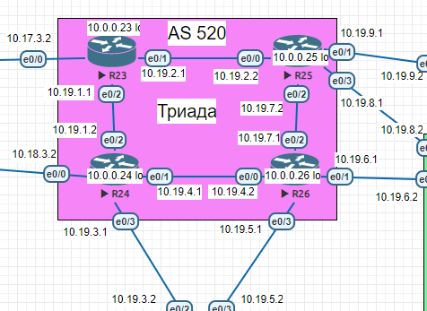

## IS-IS

### Цель:
Настроить IS-IS офисе Триада

#### Описание/Пошаговая инструкция выполнения домашнего задания:
Настроите IS-IS в ISP Триада.
- R23 и R25 находятся в зоне 2222.
- R24 находится в зоне 24.
- R26 находится в зоне 26. 
- Настройка осуществляется одновременно для IPv4 и IPv6.

### Схема  
  

### 1. R23 и R25 находятся в зоне 2222.

```
router isis
 net 49.2222.0023.0023.0023.00
 is-type level-2-only
 passive-interface default
 no passive-interface Ethernet0/1
 no passive-interface Ethernet0/2
 no passive-interface Loopback0
!
interface Ethernet0/1
 ip router isis 
!
interface Ethernet0/2
 ip router isis  
```

```
router isis
 net 49.2222.0025.0025.0025.00
 is-type level-2-only
 passive-interface default
 no passive-interface Ethernet0/0
 no passive-interface Ethernet0/2
 no passive-interface Loopback 0
interface ethernet 0/0
 ip router isis
interface Ethernet0/2
 ip router isis
```

```
R23#show isis neighbors

System Id      Type Interface   IP Address      State Holdtime Circuit Id
R24            L2   Et0/2       10.19.1.2       UP    9        R24.01
R25            L2   Et0/1       10.19.2.2       UP    7        R25.01       
```

```
R23#show ip route
Codes: L - local, C - connected, S - static, R - RIP, M - mobile, B - BGP
       D - EIGRP, EX - EIGRP external, O - OSPF, IA - OSPF inter area
       N1 - OSPF NSSA external type 1, N2 - OSPF NSSA external type 2
       E1 - OSPF external type 1, E2 - OSPF external type 2
       i - IS-IS, su - IS-IS summary, L1 - IS-IS level-1, L2 - IS-IS level-2
       ia - IS-IS inter area, * - candidate default, U - per-user static route
       o - ODR, P - periodic downloaded static route, H - NHRP, l - LISP
       a - application route
       + - replicated route, % - next hop override

Gateway of last resort is not set

      10.0.0.0/8 is variably subnetted, 16 subnets, 2 masks
C        10.0.0.0/24 is directly connected, Loopback0
L        10.0.0.23/32 is directly connected, Loopback0
C        10.17.3.0/24 is directly connected, Ethernet0/0
L        10.17.3.2/32 is directly connected, Ethernet0/0
i L2     10.18.3.0/24 [115/10] via 10.19.1.2, 00:21:58, Ethernet0/2
C        10.19.1.0/24 is directly connected, Ethernet0/2
L        10.19.1.1/32 is directly connected, Ethernet0/2
C        10.19.2.0/24 is directly connected, Ethernet0/1
L        10.19.2.1/32 is directly connected, Ethernet0/1
i L2     10.19.3.0/24 [115/10] via 10.19.1.2, 00:21:58, Ethernet0/2
i L2     10.19.4.0/24 [115/20] via 10.19.1.2, 00:21:58, Ethernet0/2
i L2     10.19.5.0/24 [115/20] via 10.19.2.2, 00:11:08, Ethernet0/1
                      [115/20] via 10.19.1.2, 00:11:08, Ethernet0/2
i L2     10.19.6.0/24 [115/20] via 10.19.2.2, 00:11:08, Ethernet0/1
                      [115/20] via 10.19.1.2, 00:11:08, Ethernet0/2
i L2     10.19.7.0/24 [115/20] via 10.19.2.2, 00:11:08, Ethernet0/1
i L2     10.19.8.0/24 [115/10] via 10.19.2.2, 00:40:36, Ethernet0/1
i L2     10.19.9.0/24 [115/10] via 10.19.2.2, 00:40:36, Ethernet0/1
```

### 2. R24 находится в зоне 24.

```
R24(config)#router isis
R24(config-router)#net 49.0024.0001.0001.0001.00
R24(config-router)#is-type level-2-only
R24(config-router)#passive-interface default
R24(config-router)#no passive-interface Ethernet0/2
R24(config-router)#no passive-interface Ethernet0/1
R24(config-router)#no passive-interface loopback 0 
R24(config)#interface ethernet 0/1
R24(config-if)#ip router isis
R24(config)#interface ethernet 0/2
R24(config-if)#ip router isis  
```

```
R24#show isis neighbors

System Id      Type Interface   IP Address      State Holdtime Circuit Id
R23            L2   Et0/2       10.19.1.1       UP    29       R24.01
R26            L2   Et0/1       10.19.4.2       UP    6        R26.01   
```

```
R24#show ip route
Codes: L - local, C - connected, S - static, R - RIP, M - mobile, B - BGP
       D - EIGRP, EX - EIGRP external, O - OSPF, IA - OSPF inter area
       N1 - OSPF NSSA external type 1, N2 - OSPF NSSA external type 2
       E1 - OSPF external type 1, E2 - OSPF external type 2
       i - IS-IS, su - IS-IS summary, L1 - IS-IS level-1, L2 - IS-IS level-2
       ia - IS-IS inter area, * - candidate default, U - per-user static route
       o - ODR, P - periodic downloaded static route, H - NHRP, l - LISP
       a - application route
       + - replicated route, % - next hop override

Gateway of last resort is not set

      10.0.0.0/8 is variably subnetted, 17 subnets, 2 masks
C        10.0.0.0/24 is directly connected, Loopback0
L        10.0.0.24/32 is directly connected, Loopback0
i L2     10.17.3.0/24 [115/10] via 10.19.1.1, 00:23:50, Ethernet0/2
C        10.18.3.0/24 is directly connected, Ethernet0/0
L        10.18.3.2/32 is directly connected, Ethernet0/0
C        10.19.1.0/24 is directly connected, Ethernet0/2
L        10.19.1.2/32 is directly connected, Ethernet0/2
i L2     10.19.2.0/24 [115/20] via 10.19.1.1, 00:23:50, Ethernet0/2
C        10.19.3.0/24 is directly connected, Ethernet0/3
L        10.19.3.1/32 is directly connected, Ethernet0/3
C        10.19.4.0/24 is directly connected, Ethernet0/1
L        10.19.4.1/32 is directly connected, Ethernet0/1
i L2     10.19.5.0/24 [115/10] via 10.19.4.2, 00:17:05, Ethernet0/1
i L2     10.19.6.0/24 [115/10] via 10.19.4.2, 00:17:05, Ethernet0/1
i L2     10.19.7.0/24 [115/20] via 10.19.4.2, 00:16:54, Ethernet0/1
i L2     10.19.8.0/24 [115/20] via 10.19.4.2, 00:12:59, Ethernet0/1
                      [115/20] via 10.19.1.1, 00:12:59, Ethernet0/2
i L2     10.19.9.0/24 [115/20] via 10.19.4.2, 00:12:59, Ethernet0/1
                      [115/20] via 10.19.1.1, 00:12:59, Ethernet0/2
```


### 3. R26 находится в зоне 26.

```
R26(config)#router isis
R26(config-router)#net 49.0026.0026.0026.0026.00
R26(config-router)#is-type level-2-only
R26(config-router)#passive-interface default
R26(config-router)#no passive-interface Ethernet0/0
R26(config-router)#no passive-interface Ethernet0/2
R26(config-router)#no passive-interface loopback 0 
R26(config)#interface ethernet 0/0
R26(config-if)#ip router isis
R26(config)#interface ethernet 0/2
R26(config-if)#ip router isis  
```

```
R26#show isis neighbors

System Id      Type Interface   IP Address      State Holdtime Circuit Id
R24            L2   Et0/0       10.19.4.1       UP    27       R26.01
R25            L2   Et0/2       10.19.7.2       UP    29       R26.02 
```

```
R26#show ip route
Codes: L - local, C - connected, S - static, R - RIP, M - mobile, B - BGP
       D - EIGRP, EX - EIGRP external, O - OSPF, IA - OSPF inter area
       N1 - OSPF NSSA external type 1, N2 - OSPF NSSA external type 2
       E1 - OSPF external type 1, E2 - OSPF external type 2
       i - IS-IS, su - IS-IS summary, L1 - IS-IS level-1, L2 - IS-IS level-2
       ia - IS-IS inter area, * - candidate default, U - per-user static route
       o - ODR, P - periodic downloaded static route, H - NHRP, l - LISP
       a - application route
       + - replicated route, % - next hop override

Gateway of last resort is not set

      10.0.0.0/8 is variably subnetted, 18 subnets, 3 masks
C        10.0.0.0/24 is directly connected, Loopback0
L        10.0.0.26/32 is directly connected, Loopback0
i L2     10.17.3.0/24 [115/20] via 10.19.7.2, 00:14:20, Ethernet0/2
                      [115/20] via 10.19.4.1, 00:14:20, Ethernet0/0
i L2     10.18.3.0/24 [115/10] via 10.19.4.1, 00:18:26, Ethernet0/0
i L2     10.19.1.0/24 [115/20] via 10.19.4.1, 00:18:26, Ethernet0/0
i L2     10.19.2.0/24 [115/20] via 10.19.7.2, 00:14:20, Ethernet0/2
i L2     10.19.3.0/24 [115/10] via 10.19.4.1, 00:18:26, Ethernet0/0
C        10.19.4.0/24 is directly connected, Ethernet0/0
L        10.19.4.2/32 is directly connected, Ethernet0/0
C        10.19.5.0/24 is directly connected, Ethernet0/3
L        10.19.5.1/32 is directly connected, Ethernet0/3
C        10.19.6.0/24 is directly connected, Ethernet0/1
L        10.19.6.1/32 is directly connected, Ethernet0/1
C        10.19.7.0/24 is directly connected, Ethernet0/2
L        10.19.7.1/32 is directly connected, Ethernet0/2
i L2     10.19.8.0/24 [115/10] via 10.19.7.2, 00:14:20, Ethernet0/2
S        10.19.9.0/24 [1/0] via 10.19.7.2
S        10.20.0.0/16 [1/0] via 10.19.6.2
```