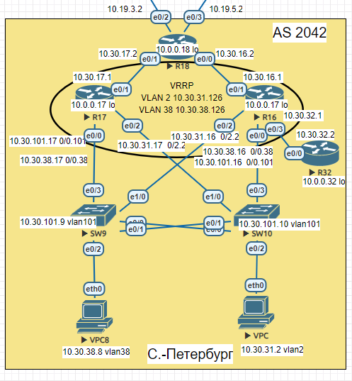

## EIGRP

#### Цель:
Настроить EIGRP в С.-Петербург;
Использовать named EIGRP

#### Описание/Пошаговая инструкция выполнения домашнего задания:
В офисе С.-Петербург настроить EIGRP.
- R32 получает только маршрут по умолчанию.
- R16-17 анонсируют только суммарные префиксы.
- Использовать EIGRP named-mode для настройки сети. 
- Настройка осуществляется одновременно для IPv4 и IPv6.

### Схема  
  

### 1. R32 получает только маршрут по умолчанию.

```
R32(config)#router eigrp NG
R32(config-router)#no shutdown 
R32(config-router)#address-family ipv4 unicast autonomous-system 1
R32(config-router-af)#network 10.30.32.0 255.255.255.0
R32(config-router-af)#no shutdown 
```

```
R32#show ip protocols
*** IP Routing is NSF aware ***

Routing Protocol is "application"
  Sending updates every 0 seconds
  Invalid after 0 seconds, hold down 0, flushed after 0
  Outgoing update filter list for all interfaces is not set
  Incoming update filter list for all interfaces is not set
  Maximum path: 32
  Routing for Networks:
  Routing Information Sources:
    Gateway         Distance      Last Update
  Distance: (default is 4)

Routing Protocol is "eigrp 1"
  Outgoing update filter list for all interfaces is not set
  Incoming update filter list for all interfaces is not set
  Default networks flagged in outgoing updates
  Default networks accepted from incoming updates
  EIGRP-IPv4 VR(NG) Address-Family Protocol for AS(1)
    Metric weight K1=1, K2=0, K3=1, K4=0, K5=0 K6=0
    Metric rib-scale 128
    Metric version 64bit
    Soft SIA disabled
    NSF-aware route hold timer is 240
    Router-ID: 10.0.0.32
    Topology : 0 (base)
      Active Timer: 3 min
      Distance: internal 90 external 170
      Maximum path: 4
      Maximum hopcount 100
      Maximum metric variance 1
      Total Prefix Count: 2
      Total Redist Count: 0

  Automatic Summarization: disabled
  Maximum path: 4
  Routing for Networks:
    10.30.0.0/16
  Routing Information Sources:
    Gateway         Distance      Last Update
    10.30.32.1            90      01:10:09
  Distance: internal 90 external 170
```

```
R32#show ip route
Codes: L - local, C - connected, S - static, R - RIP, M - mobile, B - BGP
       D - EIGRP, EX - EIGRP external, O - OSPF, IA - OSPF inter area
       N1 - OSPF NSSA external type 1, N2 - OSPF NSSA external type 2
       E1 - OSPF external type 1, E2 - OSPF external type 2
       i - IS-IS, su - IS-IS summary, L1 - IS-IS level-1, L2 - IS-IS level-2
       ia - IS-IS inter area, * - candidate default, U - per-user static route
       o - ODR, P - periodic downloaded static route, H - NHRP, l - LISP
       a - application route
       + - replicated route, % - next hop override

Gateway of last resort is 10.30.32.1 to network 0.0.0.0

D*EX  0.0.0.0/0 [170/1536000] via 10.30.32.1, 01:29:33, Ethernet0/0
      10.0.0.0/8 is variably subnetted, 4 subnets, 2 masks
C        10.0.0.0/24 is directly connected, Loopback0
L        10.0.0.32/32 is directly connected, Loopback0
C        10.30.32.0/24 is directly connected, Ethernet0/0
L        10.30.32.2/32 is directly connected, Ethernet0/0
```

### 2. R16-17 анонсируют только суммарные префиксы.


R16 передает маршрут по умолчанию для R32, передача других маршрутов через Ethernet0/3 (Линк к R32) блокируется через access-list 2 
```
R16(config)#router eigrp NG
R16(config-router)#no shutdown
R16(config-router)#address-family ipv4 unicast autonomous-system 1
R16(config-router-af)#network 10.30.0.0 0.0.255.255
R16(config-router-af-topology)#redistribute static
R16(config)#access-list 2 permit 0.0.0.0
R16(config-router-af-topology)#distribute-list 2 out Ethernet0/3
R16(config-router-af)#af-interface ethernet 0/0.38
R16(config-router-af-interface)#summary-address 10.30.0.0/16
R16(config-router-af)#af-interface ethernet 0/0.101
R16(config-router-af-interface)#summary-address 10.30.0.0/16 
R16(config-router-af)#af-interface ethernet 0/2.2
R16(config-router-af-interface)#summary-address 10.30.0.0/16
```

```
R16#show ip protocols
*** IP Routing is NSF aware ***

Routing Protocol is "application"
  Sending updates every 0 seconds
  Invalid after 0 seconds, hold down 0, flushed after 0
  Outgoing update filter list for all interfaces is not set
  Incoming update filter list for all interfaces is not set
  Maximum path: 32
  Routing for Networks:
  Routing Information Sources:
    Gateway         Distance      Last Update
  Distance: (default is 4)

Routing Protocol is "eigrp 1"
  Outgoing update filter list for all interfaces is not set
    Ethernet0/3 filtered by 2 (per-user), default is not set
  Incoming update filter list for all interfaces is not set
  Default networks flagged in outgoing updates
  Default networks accepted from incoming updates
  Redistributing: static
  EIGRP-IPv4 VR(NG) Address-Family Protocol for AS(1)
    Metric weight K1=1, K2=0, K3=1, K4=0, K5=0 K6=0
    Metric rib-scale 128
 --More--
*Dec 09 16:49:18.320: %SYS-5-CONFIG_I: Configured from console by console
    Metric version 64bit
    Soft SIA disabled
    NSF-aware route hold timer is 240
    Router-ID: 10.0.0.17
    Topology : 0 (base)
      Active Timer: 3 min
      Distance: internal 90 external 170
      Maximum path: 4
      Maximum hopcount 100
      Maximum metric variance 1
      Total Prefix Count: 8
      Total Redist Count: 1

  Automatic Summarization: disabled
  Address Summarization:
    10.30.0.0/16 for Et0/0.38, Et0/0.101, Et0/2.2
      Summarizing 6 components with metric 131072000
  Maximum path: 4
  Routing for Networks:
    10.30.0.0/16
  Routing Information Sources:
    Gateway         Distance      Last Update
    10.30.16.2            90      00:05:11
    10.30.31.17           90      00:11:23
    10.30.38.17           90      00:12:08
    10.30.32.2            90      3d20h
    10.30.101.17          90      00:12:29
  Distance: internal 90 external 170
```

```
R17(config)#router eigrp NG
R17(config-router)#no shutdown
R17(config-router)#address-family ipv4 unicast autonomous-system 1
R17(config-router-af)#network 10.30.0.0 0.0.255.255
R17(config-router-af)#af-interface ethernet 0/0.101
R17(config-router-af-interface)#summary-address 10.30.0.0/16
R17(config-router-af)#af-interface ethernet 0/0.38
R17(config-router-af-interface)#summary-address 10.30.0.0/16
R17(config-router-af)#af-interface ethernet 0/2.2
R17(config-router-af-interface)#summary-address 10.30.0.0/16
```

```
R17#show ip protocols
*** IP Routing is NSF aware ***

Routing Protocol is "application"
  Sending updates every 0 seconds
  Invalid after 0 seconds, hold down 0, flushed after 0
  Outgoing update filter list for all interfaces is not set
  Incoming update filter list for all interfaces is not set
  Maximum path: 32
  Routing for Networks:
  Routing Information Sources:
    Gateway         Distance      Last Update
  Distance: (default is 4)

Routing Protocol is "eigrp 1"
  Outgoing update filter list for all interfaces is not set
  Incoming update filter list for all interfaces is not set
  Default networks flagged in outgoing updates
  Default networks accepted from incoming updates
  EIGRP-IPv4 VR(NG) Address-Family Protocol for AS(1)
    Metric weight K1=1, K2=0, K3=1, K4=0, K5=0 K6=0
    Metric rib-scale 128
    Metric version 64bit
    Soft SIA disabled
    NSF-aware route hold timer is 240
    Router-ID: 10.0.0.17
    Topology : 0 (base)
      Active Timer: 3 min
      Distance: internal 90 external 170
      Maximum path: 4
      Maximum hopcount 100
      Maximum metric variance 1
      Total Prefix Count: 6
      Total Redist Count: 0

  Automatic Summarization: disabled
  Address Summarization:
    10.30.0.0/16 for Et0/0.101, Et0/0.38, Et0/2.2
      Summarizing 5 components with metric 131072000
  Maximum path: 4
  Routing for Networks:
    10.30.0.0/16
  Routing Information Sources:
    Gateway         Distance      Last Update
    10.30.17.2            90      00:09:11
    10.30.31.16           90      00:02:01
    10.30.38.16           90      00:02:46
    10.30.101.16          90      00:03:07
  Distance: internal 90 external 170
```

