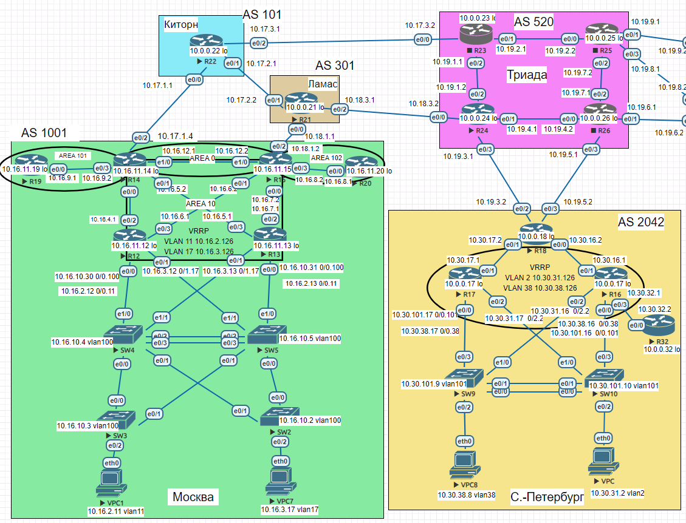

## BGP. Основы

### Цель
Настроить BGP между автономными системами<br>
Организовать доступность между офисами Москва и С.-Петербург<br>

В этой  самостоятельной работе мы ожидаем, что вы самостоятельно:

- Настроите eBGP между офисом Москва и двумя провайдерами - Киторн и Ламас.
- Настроите eBGP между провайдерами Киторн и Ламас.
- Настроите eBGP между Ламас и Триада.
- Настроите eBGP между офисом С.-Петербург и провайдером Триада.
- Организуете IP доступность между пограничным роутерами офисами Москва и С.-Петербург.

### Схема  
  

### 1. Настраиваем eBGP между офисом Москва и двумя провайдерами - Киторн и Ламас.


```
R14(config)#router bgp 1001
R14(config-router)#neighbor 10.17.1.1 remote-as 101
R22(config)#router bgp 101
R22(config-router)#neighbor 10.17.1.4 remote-as 1001
R22(config-router)#address-family ipv4
R22(config-router-af)#redistribute connected
R15(config)#router bgp 1001
R15(config-router)#neighbor 10.18.1.1 remote-as 301
R21(config)#router bgp 301
R21(config-router)#neighbor 10.18.1.2 remote-as 1001
```

### 2. Настраиваем eBGP между провайдерами Киторн и Ламас

```
R21(config)#router bgp 301
R21(config-router)#neighbor 10.17.2.1 remote-as 101
R21(config-router)#redistribute connected
R22(config)#router bgp 101
R22(config-router)#neighbor 10.17.2.1 remote-as 301
```

### 3. Настроите eBGP между Ламас и Триада.

```
R21(config)#router bgp 301
R21(config-router)#neighbor 10.18.3.2 remote-as 520
R24(config)#router bgp 520
R24(config-router)#neighbor 10.18.3.1 remote-as 301
R24(config-router)#redistribute connected
```

### 4. Настроите eBGP между офисом С.-Петербург и провайдером Триада.

```
R24(config)#router bgp 520
R24(config-router)#neighbor 10.19.3.2 remote-as 2042
R18(config)#router bgp 2042
R18(config-router)#neighbor 10.19.3.1 remote-as 520
```

### 5. Организуете IP доступность между пограничным роутерами офисами Москва и С.-Петербург.

R18 Петербург 

R15 (10.17.1.4) - Москва

R15 (10.18.1.2) - Москва

```
R18#ping 10.18.1.2
Type escape sequence to abort.
Sending 5, 100-byte ICMP Echos to 10.18.1.2, timeout is 2 seconds:
!!!!!
Success rate is 100 percent (5/5), round-trip min/avg/max = 1/1/1 ms

R18#ping 10.17.1.4
Type escape sequence to abort.
Sending 5, 100-byte ICMP Echos to 10.17.1.4, timeout is 2 seconds:
!!!!!
Success rate is 100 percent (5/5), round-trip min/avg/max = 1/1/1 ms
```
