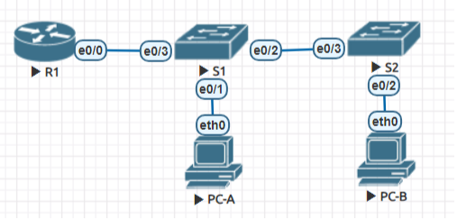

# Лабораторная работа - Configure Router-on-a-Stick Inter-VLAN Routing

## Топология

### Таблица адресации

| Устройство | Интерфейс | IP-адрес      | Маска подсети | Шлюз по умолчанию |
|------------|-----------|---------------|---------------|-------------------|
| R1         | e0/0.3    | 192.168.3.1   | 255.255.255.0 | N/A               |
| R1         | e0/0.4    | 192.168.4.1   | 255.255.255.0 | N/A               |
| R1         | e0/0.8    | N/A           | N/A           | N/A               |
| S1         | VLAN 3    | 192.168.3.11  | 255.255.255.0 | 192.168.3.1       |
| S2         | VLAN 3    | 192.168.3.12  | 255.255.255.0 | 192.168.3.1       |
| PC-A       | NIC       | 192.168.3.3   | 255.255.255.0 | 192.168.3.1       |
| PC-B       | NIC       | 192.168.4.3   | 255.255.255.0 | 192.168.4.1       |

### Таблица VLAN

| VLAN | Название    | Назначенный интерфейс         |
|------|-------------|-------------------------------|
| 3    | Management  | S1: VLAN 3                    |
|      |             | S2: VLAN 3                    |
|      |             | S1: e0/1                      |
| 4    | Operations  | S2: e0/2                      |
| 7    | ParkingLot  | S1: e0/1                      |
|      |             | S2: e0/2                      |
| 8    | Native      | N/A                           |

## Цели

Построение сети и настройка основных параметров устройств
Создание VLAN и назначение портов коммутаторов
Настройка 802.1Q транка между коммутаторами
Настройка маршрутизации между VLAN на маршрутизаторе
Проверка работоспособности маршрутизации между VLAN

## Необходимые ресурсы

- 1 маршрутизатор
- 2 коммутатора
- 2 ПК
- Консольные кабели для настройки устройств Cisco IOS через консольные порты
- Кабели Ethernet, как показано в топологии

Построение сети и настройка основных параметров устройств

### Базовая настройка устройств

#### R1 Базовая настройка:
```
Router>enable
Router#configure terminal
Router(config)#hostname R1
R1(config)#no ip domain-lookup
R1(config)#enable secret class
R1(config)#line console 0
R1(config-line)#password cisco
R1(config-line)#login
R1(config-line)#line vty 0 4
R1(config-line)#password cisco
R1(config-line)#login
R1(config-line)#service password-encryption
R1(config)#banner motd "Unauthorized access is prohibited"
R1(config)#end
R1#clock set 11:00:00 1 April 2024
R1#write
```
#### S1 Базовая настройка
```
Switch>enable
Switch#configure terminal
Switch(config)#hostname S1
S1(config)#no ip domain-lookup
S1(config)#enable secret class
S1(config)#line console 0
S1(config-line)#password cisco
S1(config-line)#login
S1(config-line)#line vty 0 4
S1(config-line)#password cisco
S1(config-line)#login
S1(config-line)#service password-encryption
S1(config)#banner motd "Unauthorized access is prohibited"
S1(config)#end
S1#clock set 11:00:00 1 April 2024
S1#write
```
#### S2 Базовая настройка
```
Switch>enable
Switch#configure terminal
Switch(config)#hostname S2
S2(config)#no ip domain-lookup
S2(config)#enable secret class
S2(config)#line console 0
S2(config-line)#password cisco
S2(config-line)#login
S2(config-line)#line vty 0 4
S2(config-line)#password cisco
S2(config-line)#login
S2(config-line)#service password-encryption
S2(config)#banner motd "Unauthorized access is prohibited"
S2(config)#end
S2#clock set 11:00:00 1 April 2024
S2#write
```

### Настраиваем VLAN на свитчах S1 и S2
#### S1 VLAN конфигурация:
```
S1#configure terminal
S1(config)#vlan 3
S1(config-vlan)#name Management
S1(config-vlan)#vlan 4
S1(config-vlan)#name Operations
S1(config-vlan)#vlan 7
S1(config-vlan)#name ParkingLot
S1(config-vlan)#vlan 8
S1(config-vlan)#name Native
S1(config-vlan)#interface vlan 3
S1(config-if)#ip address 192.168.3.11 255.255.255.0
S1(config-if)#no shutdown
S1(config-if)#ip route 0.0.0.0 0.0.0.0 192.168.3.1
S1(config)#interface ethernet 0/0
S1(config-if)#switchport mode access
S1(config-if)#switchport access vlan 7
S1(config-if)#interface ethernet 0/1
S1(config-if)#switchport mode access
S1(config-if)#switchport access vlan 3
S1(config-if)#interface range ethernet 0/2 - 3
S1(config-if-range)#switchport trunk encapsulation dot1q
S1(config-if-range)#switchport mode trunk
S1(config-if-range)#switchport trunk allowed vlan 3,4,8
S1(config-if-range)#switchport trunk native vlan 8
S1(config-if-range)#end
S1#show vlan brief

VLAN Name                             Status    Ports
---- -------------------------------- --------- -------------------------------
1    default                          active
3    Management                       active    Et0/1
4    Operations                       active
7    ParkingLot                       active    Et0/0
8    Native                           active
1002 fddi-default                     act/unsup
1003 token-ring-default               act/unsup
1004 fddinet-default                  act/unsup
1005 trnet-default                    act/unsup
S1#write
```

#### S2 VLAN конфигурация:
```
S2#configure terminal
S2(config)#vlan 3
S2(config-vlan)#name Management
S2(config-vlan)#vlan 4
S2(config-vlan)#name Operations
S2(config-vlan)#vlan 7
S2(config-vlan)#name ParkingLot
S2(config-vlan)#vlan 8
S2(config-vlan)#name Native
S2(config-vlan)#interface vlan 3
S2(config-if)#ip address 192.168.3.12 255.255.255.0
S2(config-if)#no shutdown
S2(config-if)#ip route 0.0.0.0 0.0.0.0 192.168.3.1
S2(config)#interface ethernet 0/0
S2(config-if)#switchport mode access
S2(config-if)#switchport access vlan 7
S2(config-if)#interface ethernet 0/2
S2(config-if)#switchport mode access
S2(config-if)#switchport access vlan 4
S2(config-if)#interface ethernet 0/3
S2(config-if)#switchport trunk encapsulation dot1q
S2(config-if)#switchport mode trunk
S2(config-if)#switchport trunk allowed vlan 3,4,8
S2(config-if)#switchport trunk native vlan 8
S2(config-if)#end
S2#show vlan brief

VLAN Name                             Status    Ports
---- -------------------------------- --------- -------------------------------
1    default                          active    Et0/1
3    Management                       active
4    Operations                       active    Et0/2
7    ParkingLot                       active    Et0/0
8    Native                           active
1002 fddi-default                     act/unsup
1003 token-ring-default               act/unsup
1004 fddinet-default                  act/unsup
1005 trnet-default                    act/unsup
S2#write
```
#### R1 конфигурация:
```
R1#configure terminal
R1(config)#interface ethernet 0/3
R1(config-if)#no shutdown
R1(config-if)#interface ethernet 0/0.3
R1(config-subif)#description GW VLAN 3
R1(config-subif)#encapsulation dot1Q 3
R1(config-subif)#ip add 192.168.3.1 255.255.255.0
R1(config-subif)#interface ethernet 0/0.4        
R1(config-subif)#description GW VLAN 4
R1(config-subif)#encapsulation dot1Q 4
R1(config-subif)#ip add 192.168.4.1 255.255.255.0
R1(config-subif)#interface ethernet 0/0.8
R1(config-subif)#end
R1#write
```
#### PC-A и PC-B IP конфигурация:
PC-A:
```
ip 192.168.3.3 255.255.255.0 192.168.3.1
```
PC-B:
```
ip 192.168.4.3 255.255.255.0 192.168.4.1
```
#### Проверка PC-A:

```
VPCS> show ip
NAME        : VPCS[1]
IP/MASK     : 192.168.3.3/24
GATEWAY     : 192.168.3.1
DNS         :
MAC         : 00:50:79:66:68:02
LPORT       : 20000
RHOST:PORT  : 127.0.0.1:30000
MTU         : 1500

VPCS> ping 192.168.3.1

84 bytes from 192.168.3.1 icmp_seq=1 ttl=255 time=0.627 ms
84 bytes from 192.168.3.1 icmp_seq=2 ttl=255 time=2.167 ms
84 bytes from 192.168.3.1 icmp_seq=3 ttl=255 time=2.581 ms
84 bytes from 192.168.3.1 icmp_seq=4 ttl=255 time=2.437 ms
84 bytes from 192.168.3.1 icmp_seq=5 ttl=255 time=2.194 ms

VPCS> ping 192.168.4.3

84 bytes from 192.168.4.3 icmp_seq=1 ttl=63 time=2.057 ms
84 bytes from 192.168.4.3 icmp_seq=2 ttl=63 time=5.000 ms
84 bytes from 192.168.4.3 icmp_seq=3 ttl=63 time=4.093 ms
84 bytes from 192.168.4.3 icmp_seq=4 ttl=63 time=4.344 ms
84 bytes from 192.168.4.3 icmp_seq=5 ttl=63 time=2.192 ms

VPCS> ping 192.168.3.12

84 bytes from 192.168.3.12 icmp_seq=1 ttl=255 time=0.496 ms
84 bytes from 192.168.3.12 icmp_seq=2 ttl=255 time=0.663 ms
84 bytes from 192.168.3.12 icmp_seq=3 ttl=255 time=1.078 ms
84 bytes from 192.168.3.12 icmp_seq=4 ttl=255 time=0.506 ms
84 bytes from 192.168.3.12 icmp_seq=5 ttl=255 time=2.414 ms
```
#### Проверка PC-B:
```
VPCS> show ip

NAME        : VPCS[1]
IP/MASK     : 192.168.4.3/24
GATEWAY     : 192.168.4.1
DNS         :
MAC         : 00:50:79:66:68:03
LPORT       : 20000
RHOST:PORT  : 127.0.0.1:30000
MTU         : 1500

VPCS> trace 192.168.3.3 -P 1
trace to 192.168.3.3, 8 hops max (ICMP), press Ctrl+C to stop
 1   192.168.4.1   0.856 ms  0.518 ms  0.627 ms
 2   192.168.3.3   0.989 ms  0.958 ms  1.055 ms
```
