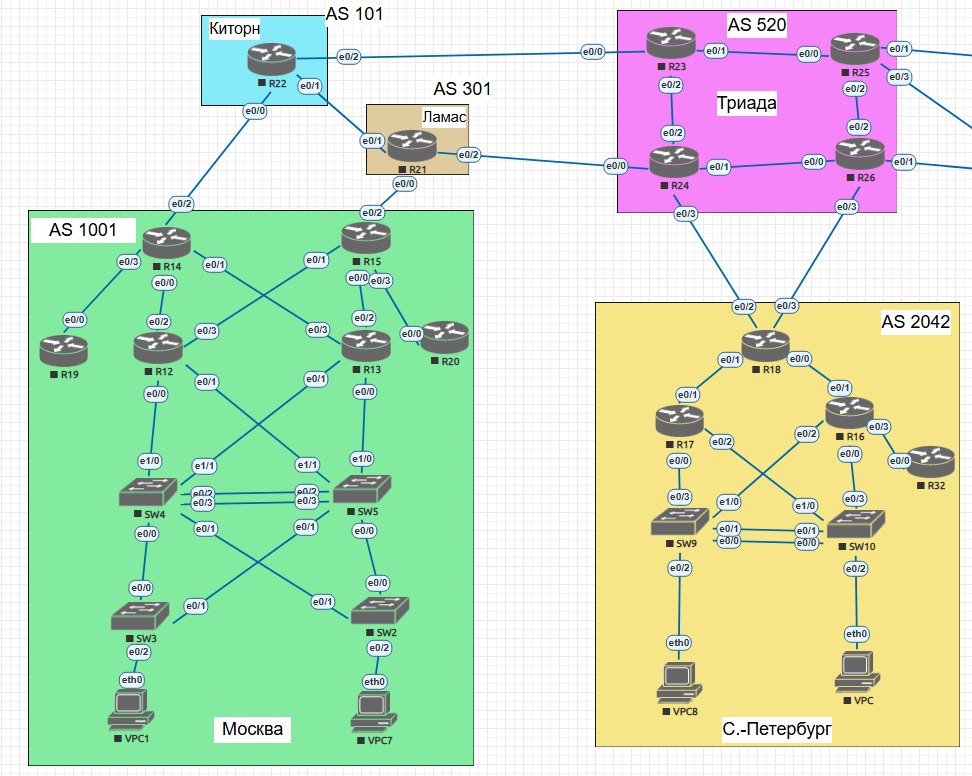

## iBGP

### Цель:
- Настроить iBGP в офисе Москва
- Настроить iBGP в сети провайдера Триада
- Организовать полную IP связанность всех сетей 

### Описание/Пошаговая инструкция выполнения домашнего задания:
В этой  самостоятельной работе мы ожидаем, что вы самостоятельно:

- Настроите iBGP в офисом Москва между маршрутизаторами R14 и R15.
- Настроите iBGP в провайдере Триада.
- Настройте офиса Москва так, чтобы приоритетным провайдером стал Ламас.
- Настройте офиса С.-Петербург так, чтобы трафик до любого офиса распределялся по двум линкам одновременно.
- Все сети в лабораторной работе должны иметь IP связность.

### Схема 
  

### 1. Настроите iBGP в офисе Москва между маршрутизаторами R14 и R15.

```
R14(config)#router ospf 1
R14(config)#no passive-interface loopback 0
R14(config)#network 10.16.11.0 0.0.0.255 area 0
R14(config)#router bgp 1001
R14(config-router)#neighbor 10.16.11.15 remote-as 1001
R14(config-router)#neighbor 10.16.11.15 update-source loopback 0
R15(config)#router ospf 1
R15(config)#no passive-interface loopback 0
R15(config)#network 10.16.11.0 0.0.0.255 area 0
R15(config)#router bgp 1001
R15(config-router)#network 10.16.6.0 mask 255.255.255.0
R15(config-router)#network 10.16.7.0 mask 255.255.255.0
R15(config-router)#network 10.16.11.0 mask 255.255.255.0
R15(config-router)#network 10.16.12.0 mask 255.255.255.0
R15(config-router)#neighbor 10.16.11.14 remote-as 1001
R15(config-router)#neighbor 10.16.11.14 update-source loopback 0
```

### 2. Настроите iBGP в провайдере Триада, с использованием RR.

Роутер R23 будет reflector server

```
R23(config)#router bgp 520
R23(config-router)#neighbor RR-CLIENT peer-group
R23(config-router)#neighbor RR-CLIENT remote-as 520
R23(config-router)#neighbor RR-CLIENT update-source loopback 0
R23(config-router)#neighbor RR-CLIENT route-reflector-client
R23(config-router)#neighbor 10.0.0.24 peer-group RR-CLIENT
R23(config-router)#neighbor 10.0.0.26 peer-group RR-CLIENT
R23(config-router)#neighbor 10.0.0.25 peer-group RR-CLIENT
R23(config-router)#bgp cluster-id 520
```

R24-R26 будут клиентами R23 и находятся в одном кластере, чтобы предотвратить повторное получение маршрутов и уменьшить нагрузку на сеть, настройки одинаковы для всех клиентов.
```
R24(config)#router bgp 520
R24(config-router)#neighbor 10.0.0.23 remote-as 520
R24(config-router)#bgp cluster-id 520
```


### 3. Настройте офис Москва так, чтобы приоритетным провайдером стал Ламас.

Вариант с weight

```
R14(config)#router bgp 1001
R14(config-router)#neighbor 10.16.11.15 weight 32768
```

```
R15(config)#router bgp 1001
R15(config-router)#neighbor 10.16.12.1 next-hop-self
```

Вариант с local-preference

```
R15(config)#route-map R21-in permit 10
R15(config-route-map)#set local-preference 200
R15(config)#router bgp 1001
R15(config-router)#neighbor 10.18.1.1 route-map R21-in in
```
Провайдер Ламас приоритетный по local-preference

```
R15#show ip bgp
BGP table version is 47, local router ID is 10.16.11.15
Status codes: s suppressed, d damped, h history, * valid, > best, i - internal,
              r RIB-failure, S Stale, m multipath, b backup-path, f RT-Filter,
              x best-external, a additional-path, c RIB-compressed,
Origin codes: i - IGP, e - EGP, ? - incomplete
RPKI validation codes: V valid, I invalid, N Not found

     Network          Next Hop            Metric LocPrf Weight Path
 r>i 10.16.2.0/24     10.16.4.1               20    100      0 i
 * i 10.16.3.0/24     10.16.4.1               20    100      0 i
 *>                   10.16.6.1               20         32768 i
 *>  10.16.6.0/24     0.0.0.0                  0         32768 i
 *>  10.16.8.0/24     0.0.0.0                  0         32768 i
 r>i 10.16.9.0/24     10.16.11.14              0    100      0 i
 *>  10.16.11.0/24    0.0.0.0                  0         32768 i
 * i 10.16.12.0/24    10.16.11.14              0    100      0 i
 *>                   0.0.0.0                  0         32768 i
 *>i 10.17.1.0/24     10.16.11.14              0    100      0 i
 *>  10.17.2.0/24     10.18.1.1                0    200      0 301 i
 *>  10.17.3.0/24     10.18.1.1                     200      0 301 520 i
 r>  10.18.1.0/24     10.18.1.1                0    200      0 301 i
 *>  10.18.3.0/24     10.18.1.1                0    200      0 301 i
 *>  10.19.1.0/24     10.18.1.1                     200      0 301 520 i
 *>  10.19.2.0/24     10.18.1.1                     200      0 301 520 i
 *>  10.19.3.0/24     10.18.1.1                     200      0 301 520 i
 *>  10.19.4.0/24     10.18.1.1                     200      0 301 520 i
 *>  10.19.5.0/24     10.18.1.1                     200      0 301 520 2042 i
 *>  10.19.6.0/24     10.18.1.1                     200      0 301 101 520 i
 *>  10.19.7.0/24     10.18.1.1                     200      0 301 101 520 i
 *>  10.19.8.0/24     10.18.1.1                     200      0 301 101 520 i
 *>  10.19.9.0/24     10.18.1.1                     200      0 301 101 520 i
 *>  10.30.16.0/24    10.18.1.1                     200      0 301 520 2042 i
 *>  10.30.17.0/24    10.18.1.1                     200      0 301 520 2042 i
 *>  10.30.31.0/24    10.18.1.1                     200      0 301 520 2042 i
 *>  10.30.38.0/24    10.18.1.1                     200      0 301 520 2042 i
 ```

Теперь R14 имеет приоритетный маршрут через R15 (10.16.11.15) с выходом на Ламас.

```
R14#show ip bgp
BGP table version is 62, local router ID is 10.16.11.14
Status codes: s suppressed, d damped, h history, * valid, > best, i - internal,
              r RIB-failure, S Stale, m multipath, b backup-path, f RT-Filter,
              x best-external, a additional-path, c RIB-compressed,
Origin codes: i - IGP, e - EGP, ? - incomplete
RPKI validation codes: V valid, I invalid, N Not found

     Network          Next Hop            Metric LocPrf Weight Path
 *>  10.16.2.0/24     10.16.4.1               20         32768 i
 * i 10.16.3.0/24     10.16.11.15             20    100  32768 i
 *>                   10.16.4.1               20         32768 i
 r>i 10.16.6.0/24     10.16.11.15              0    100  32768 i
 r>i 10.16.8.0/24     10.16.11.15              0    100  32768 i
 *>  10.16.9.0/24     0.0.0.0                  0         32768 i
 r>i 10.16.11.0/24    10.16.11.15              0    100  32768 i
 * i 10.16.12.0/24    10.16.11.15              0    100  32768 i
 *>                   0.0.0.0                  0         32768 i
 *>  10.17.1.0/24     0.0.0.0                  0         32768 i
 *   10.17.2.0/24     10.17.1.1                              0 101 301 i
 *>i                  10.16.11.15              0    200  32768 301 i
 *>i 10.17.3.0/24     10.16.11.15              0    200  32768 301 520 i
 *                    10.17.1.1                              0 101 520 i
 *   10.18.1.0/24     10.17.1.1                              0 101 301 i
 *>i                  10.16.11.15              0    200  32768 301 i
 *   10.18.3.0/24     10.17.1.1                              0 101 301 i
 *>i                  10.16.11.15              0    200  32768 301 i
 *>i 10.19.1.0/24     10.16.11.15              0    200  32768 301 520 i
 *                    10.17.1.1                              0 101 520 i
 *>i 10.19.2.0/24     10.16.11.15              0    200  32768 301 520 i
 *                    10.17.1.1                              0 101 520 i
 *   10.19.3.0/24     10.17.1.1                              0 101 520 i
 *>i                  10.16.11.15              0    200  32768 301 520 i
 *   10.19.4.0/24     10.17.1.1                              0 101 520 i
 *>i                  10.16.11.15              0    200  32768 301 520 i
 *   10.19.5.0/24     10.17.1.1                              0 101 520 i
 *>i                  10.16.11.15              0    200  32768 301 520 2042 i
 *>i 10.19.6.0/24     10.16.11.15              0    200  32768 301 101 520 i
 *                    10.17.1.1                              0 101 520 i
 *>i 10.19.7.0/24     10.16.11.15              0    200  32768 301 101 520 i
 *                    10.17.1.1                              0 101 520 i
 *>i 10.19.8.0/24     10.16.11.15              0    200  32768 301 101 520 i
 *                    10.17.1.1                              0 101 520 i
 *>i 10.19.9.0/24     10.16.11.15              0    200  32768 301 101 520 i
 *                    10.17.1.1                              0 101 520 i
 *   10.30.16.0/24    10.17.1.1                              0 101 520 2042 i
 *>i                  10.16.11.15              0    200  32768 301 520 2042 i
 *   10.30.17.0/24    10.17.1.1                              0 101 520 2042 i
 *>i                  10.16.11.15              0    200  32768 301 520 2042 i
 *   10.30.31.0/24    10.17.1.1                              0 101 520 2042 i
 *>i                  10.16.11.15              0    200  32768 301 520 2042 i
 *   10.30.38.0/24    10.17.1.1                              0 101 520 2042 i
 *>i                  10.16.11.15              0    200  32768 301 520 2042 i
 ```

### 4. Настройте офис С.-Петербург так, чтобы трафик до любого офиса распределялся по двум линкам одновременно.

```
R18(config)#router bgp 2042
R18(config-router)#bgp bestpath as-path multipath-relax
R18(config-router)#maximum-paths 2
```

```
R18#show ip bgp
BGP table version is 29, local router ID is 10.0.0.18
Status codes: s suppressed, d damped, h history, * valid, > best, i - internal,
              r RIB-failure, S Stale, m multipath, b backup-path, f RT-Filter,
              x best-external, a additional-path, c RIB-compressed,
Origin codes: i - IGP, e - EGP, ? - incomplete
RPKI validation codes: V valid, I invalid, N Not found

     Network          Next Hop            Metric LocPrf Weight Path
 *>  10.16.2.0/24     10.19.3.1                              0 520 301 1001 i
 *                    10.19.5.1                              0 520 101 1001 i
 *>  10.16.3.0/24     10.19.3.1                              0 520 301 1001 i
 *                    10.19.5.1                              0 520 101 1001 i
 *>  10.16.4.0/24     10.19.3.1                              0 520 301 1001 i
 *                    10.19.5.1                              0 520 101 1001 i
 *>  10.16.5.0/24     10.19.3.1                              0 520 301 1001 i
 *                    10.19.5.1                              0 520 101 1001 i
 *>  10.16.6.0/24     10.19.3.1                              0 520 301 1001 i
 *                    10.19.5.1                              0 520 101 1001 i
 *>  10.16.7.0/24     10.19.3.1                              0 520 301 1001 i
 *                    10.19.5.1                              0 520 101 1001 i
 *>  10.16.8.0/24     10.19.3.1                              0 520 301 1001 i
 *                    10.19.5.1                              0 520 101 1001 i
 *>  10.16.9.0/24     10.19.3.1                              0 520 301 1001 i
 *                    10.19.5.1                              0 520 101 1001 i
 *>  10.16.11.0/24    10.19.3.1                              0 520 301 1001 i
 *                    10.19.5.1                              0 520 101 1001 i
 *>  10.16.12.0/24    10.19.3.1                              0 520 301 1001 i
 *                    10.19.5.1                              0 520 101 1001 i
 *>  10.17.1.0/24     10.19.3.1                              0 520 301 1001 i
 *                    10.19.5.1                              0 520 101 1001 i
 *>  10.17.2.0/24     10.19.3.1                              0 520 301 i
 *                    10.19.5.1                              0 520 301 i
 *>  10.17.3.0/24     10.19.3.1                              0 520 i
 *                    10.19.5.1                              0 520 i
 *>  10.18.1.0/24     10.19.3.1                              0 520 301 i
 *                    10.19.5.1                              0 520 301 i
 *>  10.18.3.0/24     10.19.3.1                0             0 520 i
 *                    10.19.5.1                              0 520 i
 *>  10.19.1.0/24     10.19.3.1                0             0 520 i
 *                    10.19.5.1                              0 520 i
 *>  10.19.2.0/24     10.19.3.1                              0 520 i
 *                    10.19.5.1                              0 520 i
 *   10.19.3.0/24     10.19.3.1                0             0 520 i
 *                    10.19.5.1                              0 520 i
 *>                   0.0.0.0                  0         32768 i
 *>  10.19.4.0/24     10.19.3.1                0             0 520 i
 *                    10.19.5.1                0             0 520 i
 *   10.19.5.0/24     10.19.3.1                              0 520 i
 *                    10.19.5.1                0             0 520 i
 *>                   0.0.0.0                  0         32768 i
 *>  10.19.6.0/24     10.19.3.1                              0 520 i
 *                    10.19.5.1                0             0 520 i
 *>  10.19.7.0/24     10.19.3.1                              0 520 i
 *                    10.19.5.1                0             0 520 i
 *>  10.19.8.0/24     10.19.3.1                              0 520 i
 *                    10.19.5.1                              0 520 i
 *>  10.19.9.0/24     10.19.3.1                              0 520 i
 *                    10.19.5.1                              0 520 i
 *>  10.30.16.0/24    0.0.0.0                  0         32768 i
 *>  10.30.17.0/24    0.0.0.0                  0         32768 i
 *>  10.30.31.0/24    10.30.16.1         1536000         32768 i
 *>  10.30.38.0/24    10.30.16.1         1536000         32768 i
```

bgp bestpath as-path multipath-relax заработал, есть маршруты с одинаковым AS_PATH.

### 5. Все сети в лабораторной работе должны иметь IP связность.

Ping от VPC1 Москва к VPC8 С.-Петербург

```
VPC1> ping 10.30.38.8

84 bytes from 10.30.38.8 icmp_seq=1 ttl=58 time=2.573 ms
84 bytes from 10.30.38.8 icmp_seq=2 ttl=58 time=1.351 ms
84 bytes from 10.30.38.8 icmp_seq=3 ttl=58 time=1.486 ms
84 bytes from 10.30.38.8 icmp_seq=4 ttl=58 time=1.337 ms
84 bytes from 10.30.38.8 icmp_seq=5 ttl=58 time=1.461 ms
```

Ping от VPC С.-Петербург к VPC7 Москва

```
VPC> ping 10.16.3.17

84 bytes from 10.16.3.17 icmp_seq=1 ttl=58 time=1.297 ms
84 bytes from 10.16.3.17 icmp_seq=2 ttl=58 time=1.348 ms
84 bytes from 10.16.3.17 icmp_seq=3 ttl=58 time=1.363 ms
84 bytes from 10.16.3.17 icmp_seq=4 ttl=58 time=1.253 ms
84 bytes from 10.16.3.17 icmp_seq=5 ttl=58 time=1.208 ms
```