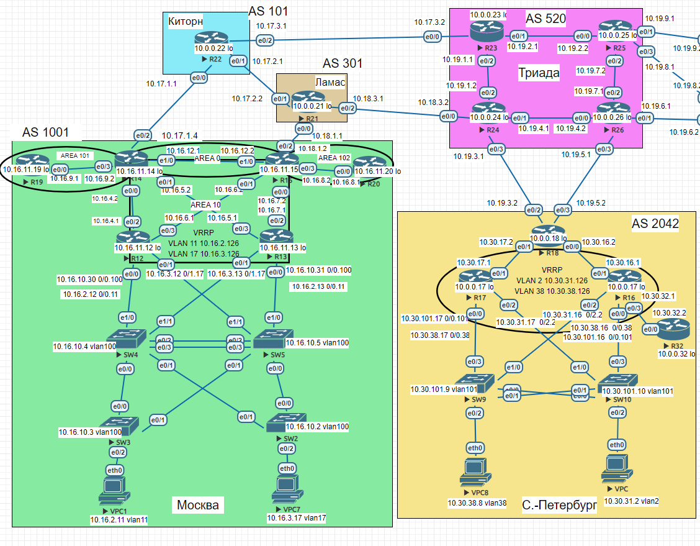

## BGP. Фильтрация

### Цель:
- Настроить фильтрацию для офисе Москва
- Настроить фильтрацию для офисе С.-Петербург

### Описание/Пошаговая инструкция выполнения домашнего задания:
В этой  самостоятельной работе мы ожидаем, что вы самостоятельно:

- Настроить фильтрацию в офисе Москва так, чтобы не появилось транзитного трафика(As-path).
- Настроить фильтрацию в офисе С.-Петербург так, чтобы не появилось транзитного трафика(Prefix-list).
- Настроить провайдера Киторн так, чтобы в офис Москва отдавался только маршрут по умолчанию.
- Настроить провайдера Ламас так, чтобы в офис Москва отдавался только маршрут по умолчанию и префикс офиса С.-Петербург.
- Все сети в лабораторной работе должны иметь IP связность.

### Схема 
  

### 1. Настроить фильтрацию в офисе Москва так, чтобы не появилось транзитного трафика(As-path)


```
R14(config)#ip as-path access-list 1 permit ^$
R14(config)#route-map R22-out permit 5
R14(config-route-map)#match as-path 1
R14(config)#router bgp 1001
R14(config-router)#neighbor 10.17.1.1 route-map R22-out out
```

Теперь мы не анонсируем маршруты других AS на R14

```
R14#show ip bgp neighbors 10.17.1.1 advertised-routes
BGP table version is 26, local router ID is 10.16.11.14
Status codes: s suppressed, d damped, h history, * valid, > best, i - internal,
              r RIB-failure, S Stale, m multipath, b backup-path, f RT-Filter,
              x best-external, a additional-path, c RIB-compressed,
Origin codes: i - IGP, e - EGP, ? - incomplete
RPKI validation codes: V valid, I invalid, N Not found

     Network          Next Hop            Metric LocPrf Weight Path
 *>  10.16.2.0/24     10.16.4.1               20         32768 i
 *>  10.16.3.0/24     10.16.4.1               20         32768 i
 r>i 10.16.6.0/24     10.16.11.15              0    100  32768 i
 r>i 10.16.8.0/24     10.16.11.15              0    100  32768 i
 *>  10.16.9.0/24     0.0.0.0                  0         32768 i
 r>i 10.16.11.0/24    10.16.11.15              0    100  32768 i
 *>  10.16.12.0/24    0.0.0.0                  0         32768 i
 *>  10.17.1.0/24     0.0.0.0                  0         32768 i
```

Для R15 аналогичная конфигурация к соседу 10.18.1.1 

```
R15#show ip bgp neighbors 10.18.1.1 advertised-routes
BGP table version is 64, local router ID is 10.16.11.15
Status codes: s suppressed, d damped, h history, * valid, > best, i - internal,
              r RIB-failure, S Stale, m multipath, b backup-path, f RT-Filter,
              x best-external, a additional-path, c RIB-compressed,
Origin codes: i - IGP, e - EGP, ? - incomplete
RPKI validation codes: V valid, I invalid, N Not found

     Network          Next Hop            Metric LocPrf Weight Path
 r>i 10.16.2.0/24     10.16.4.1               20    100      0 i
 *>  10.16.3.0/24     10.16.6.1               20         32768 i
 *>  10.16.6.0/24     0.0.0.0                  0         32768 i
 *>  10.16.8.0/24     0.0.0.0                  0         32768 i
 r>i 10.16.9.0/24     10.16.11.14              0    100      0 i
 *>  10.16.11.0/24    0.0.0.0                  0         32768 i
 *>  10.16.12.0/24    0.0.0.0                  0         32768 i
 *>i 10.17.1.0/24     10.16.11.14              0    100      0 i

Total number of prefixes 8
```

### 2. Настроить фильтрацию в офисе С.-Петербург так, чтобы не появилось транзитного трафика(Prefix-list).

```
R18(config)#ip prefix-list ALLOW_SPECIFIC_NETWORKS seq 10 permit 10.19.3.0/24
R18(config)#ip prefix-list ALLOW_SPECIFIC_NETWORKS seq 11 permit 10.19.5.0/24
R18(config)#ip prefix-list ALLOW_SPECIFIC_NETWORKS seq 12 permit 10.30.16.0/24
R18(config)#ip prefix-list ALLOW_SPECIFIC_NETWORKS seq 13 permit 10.30.17.0/24
R18(config)#ip prefix-list ALLOW_SPECIFIC_NETWORKS seq 14 permit 10.30.31.0/24
R18(config)#ip prefix-list ALLOW_SPECIFIC_NETWORKS seq 15 permit 10.30.38.0/24
R18(config)#router bgp 2042
R18(config-router)#neighbor 10.19.3.1 prefix-list ALLOW_SPECIFIC_NETWORKS out
R18(config-router)#neighbor 10.19.5.1 prefix-list ALLOW_SPECIFIC_NETWORKS out
```

R18 анонсирует своим соседям только сети AS 2042

```
R18#show ip bgp neighbors 10.19.3.1 advertised-routes
BGP table version is 50, local router ID is 10.0.0.18
Status codes: s suppressed, d damped, h history, * valid, > best, i - internal,
              r RIB-failure, S Stale, m multipath, b backup-path, f RT-Filter,
              x best-external, a additional-path, c RIB-compressed,
Origin codes: i - IGP, e - EGP, ? - incomplete
RPKI validation codes: V valid, I invalid, N Not found

     Network          Next Hop            Metric LocPrf Weight Path
 *>  10.19.3.0/24     0.0.0.0                  0         32768 i
 *>  10.19.5.0/24     0.0.0.0                  0         32768 i
 *>  10.30.16.0/24    0.0.0.0                  0         32768 i
 *>  10.30.17.0/24    0.0.0.0                  0         32768 i
 *>  10.30.31.0/24    10.30.16.1         1536000         32768 i
 *>  10.30.38.0/24    10.30.16.1         1536000         32768 i

Total number of prefixes 6
```

```
R18#show ip bgp neighbors 10.19.5.1 advertised-routes
BGP table version is 50, local router ID is 10.0.0.18
Status codes: s suppressed, d damped, h history, * valid, > best, i - internal,
              r RIB-failure, S Stale, m multipath, b backup-path, f RT-Filter,
              x best-external, a additional-path, c RIB-compressed,
Origin codes: i - IGP, e - EGP, ? - incomplete
RPKI validation codes: V valid, I invalid, N Not found

     Network          Next Hop            Metric LocPrf Weight Path
 *>  10.19.3.0/24     0.0.0.0                  0         32768 i
 *>  10.19.5.0/24     0.0.0.0                  0         32768 i
 *>  10.30.16.0/24    0.0.0.0                  0         32768 i
 *>  10.30.17.0/24    0.0.0.0                  0         32768 i
 *>  10.30.31.0/24    10.30.16.1         1536000         32768 i
 *>  10.30.38.0/24    10.30.16.1         1536000         32768 i

Total number of prefixes 6
```

### 3. Настроить провайдера Киторн так, чтобы в офис Москва отдавался только маршрут по умолчанию.

```
R22(config)#router bgp 101
R22(config-router)#neighbor 10.17.1.4 default-originate
R22(config)#ip prefix-list ALL deny 0.0.0.0/0 Le 32
R22(config)#router bgp 101
R22(config-router)#neighbor 10.17.1.4 prefix-list ALL out
```

R14 получил дефолт от R22 (10.17.1.1) и больше ничего

```
R14(config)#router bgp 1001
R14(config-router)#neighbor 10.17.1.1 soft-reconfiguration inbound
R14#show ip bgp neighbors 10.17.1.1 received-routes
BGP table version is 27, local router ID is 10.16.11.14
Status codes: s suppressed, d damped, h history, * valid, > best, i - internal,
              r RIB-failure, S Stale, m multipath, b backup-path, f RT-Filter,
              x best-external, a additional-path, c RIB-compressed,
Origin codes: i - IGP, e - EGP, ? - incomplete
RPKI validation codes: V valid, I invalid, N Not found

     Network          Next Hop            Metric LocPrf Weight Path
 *>  0.0.0.0          10.17.1.1                              0 101 i

Total number of prefixes 1
```


# 4. Настроить провайдера Ламас так, чтобы в офис Москва отдавался только маршрут по умолчанию и префикс офиса С.-Петербург.

```
R21(config)#ip prefix-list ALLOW_ONLY_10.30.17.0 seq 10 permit 10.30.17.0/24
R21(config)#router bgp 301
R21(config-router)#neighbor 10.18.1.2 default-originate
R21(config-router)#neighbor 10.18.1.2 prefix-list ALLOW_ONLY_10.30.17.0 out
```

```
R15(config-router)#neighbor 10.18.1.1 soft-reconfiguration inbound
R15#show ip bgp neighbors 10.18.1.1 received-routes
BGP table version is 83, local router ID is 10.16.11.15
Status codes: s suppressed, d damped, h history, * valid, > best, i - internal,
              r RIB-failure, S Stale, m multipath, b backup-path, f RT-Filter,
              x best-external, a additional-path, c RIB-compressed,
Origin codes: i - IGP, e - EGP, ? - incomplete
RPKI validation codes: V valid, I invalid, N Not found

     Network          Next Hop            Metric LocPrf Weight Path
 *   0.0.0.0          10.18.1.1                              0 301 i
 *   10.30.17.0/24    10.18.1.1                              0 301 520 2042 i

Total number of prefixes 2
```

R15 получает от Ламас (R21) только дефолт и маршрут в сети С.-Петербург

### 5. Все сети в лабораторной работе должны иметь IP связность.

Ping от VPC1 Москва к VPC8 С.-Петербург

```
VPC1> ping 10.30.38.8

84 bytes from 10.30.38.8 icmp_seq=1 ttl=58 time=2.573 ms
84 bytes from 10.30.38.8 icmp_seq=2 ttl=58 time=1.351 ms
84 bytes from 10.30.38.8 icmp_seq=3 ttl=58 time=1.486 ms
84 bytes from 10.30.38.8 icmp_seq=4 ttl=58 time=1.337 ms
84 bytes from 10.30.38.8 icmp_seq=5 ttl=58 time=1.461 ms
```

Ping от VPC С.-Петербург к VPC7 Москва

```
VPC> ping 10.16.3.17

84 bytes from 10.16.3.17 icmp_seq=1 ttl=58 time=1.297 ms
84 bytes from 10.16.3.17 icmp_seq=2 ttl=58 time=1.348 ms
84 bytes from 10.16.3.17 icmp_seq=3 ttl=58 time=1.363 ms
84 bytes from 10.16.3.17 icmp_seq=4 ttl=58 time=1.253 ms
84 bytes from 10.16.3.17 icmp_seq=5 ttl=58 time=1.208 ms
```