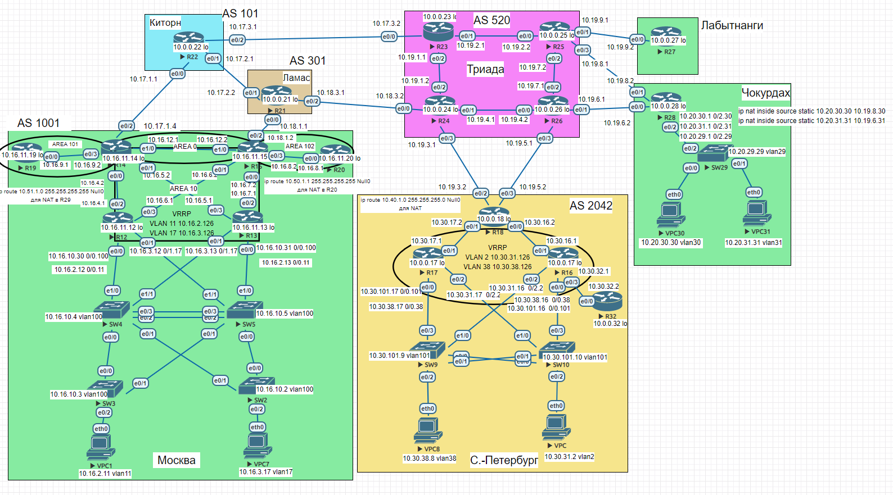

## Основные протоколы сети интернет. NAT. DHCP. NTP

### Цель:  
- Настроить NAT в офисе Москва, C.-Перетбруг и Чокурдах
- Настроить синхронизацию времени в офисе Москва
- Настроить DHCP в офисе Москва

#### Описание/Пошаговая инструкция выполнения домашнего задания:
В этой самостоятельной работе мы ожидаем, что вы самостоятельно:

- Настроите NAT(PAT) на R14 и R15. Трансляция должна осуществляться в адрес автономной системы AS1001.
- Настроите NAT(PAT) на R18. Трансляция должна осуществляться в пул из 5 адресов автономной системы AS2042.
- Настроите статический NAT для R20.
- Настроите NAT так, чтобы R19 был доступен с любого узла для удаленного управления. 
- *Настроите статический NAT(PAT) для офиса Чокурдах.
- Настроите для IPv4 DHCP сервер в офисе Москва на маршрутизаторах R12 и R13. VPC1 и VPC7 должны получать сетевые настройки по DHCP.
- Настроите NTP сервер на R12 и R13. Все устройства в офисе Москва должны синхронизировать время с R12 и R13.
- Все офисы в лабораторной работе должны иметь IP связность.

### Схема 
  

### 1. Настроите NAT(PAT) на R14 и R15. Трансляция должна осуществляться в адрес автономной системы AS1001


```
R14(config)#interface ethernet 0/2
R14(config-if)#ip nat outside
R14(config)#interface ethernet 0/0
R14(config-if)#ip nat inside
R14(config)#interface ethernet 0/1
R14(config-if)#ip nat inside
R14(config)#interface ethernet 0/3
R14(config-if)#ip nat inside
R14(config)#ip access-list standard NAT_ACL
R14(config-std-nacl)#permit 10.16.0.0 0.0.255.255
R14(config)#ip nat inside source list NAT_ACL interface ethernet 0/2 overload
```

```
R15(config)#interface ethernet 0/2
R15(config-if)#ip nat outside
R15(config)#interface ethernet 0/0
R15(config-if)#ip nat inside
R15(config)#interface ethernet 0/1
R15(config-if)#ip nat inside
R15(config)#interface ethernet 0/3
R15(config-if)#ip nat inside
R15(config)#ip access-list standard NAT_ACL
R15(config-std-nacl)#permit 10.16.0.0 0.0.255.255
R15(config)#ip nat inside source list NAT_ACL interface ethernet 0/2 overload
```

Проверяем NAT, делаем пинг от VPC1 к VPC

```
VPC1> ping 10.30.31.2

84 bytes from 10.30.31.2 icmp_seq=1 ttl=58 time=1.459 ms
84 bytes from 10.30.31.2 icmp_seq=2 ttl=58 time=1.294 ms
84 bytes from 10.30.31.2 icmp_seq=3 ttl=58 time=1.355 ms
84 bytes from 10.30.31.2 icmp_seq=4 ttl=58 time=1.272 ms
84 bytes from 10.30.31.2 icmp_seq=5 ttl=58 time=1.237 ms
```

Смотрим NAT на R15 (на R14 ничего не увидим т.к. основой провайдер Ламас).

```
R15#show ip nat translations
Pro Inside global      Inside local       Outside local      Outside global
icmp 10.18.1.2:15695   10.16.2.11:15695   10.30.31.2:15695   10.30.31.2:15695
icmp 10.18.1.2:15951   10.16.2.11:15951   10.30.31.2:15951   10.30.31.2:15951
icmp 10.18.1.2:16207   10.16.2.11:16207   10.30.31.2:16207   10.30.31.2:16207
icmp 10.18.1.2:16463   10.16.2.11:16463   10.30.31.2:16463   10.30.31.2:16463
udp 10.18.1.2:59440    10.16.2.11:59440   10.30.31.2:59441   10.30.31.2:59441
R15#show ip nat statistics
Total active translations: 6 (0 static, 6 dynamic; 6 extended)
Peak translations: 6, occurred 00:00:02 ago
Outside interfaces:
  Ethernet0/2
Inside interfaces:
  Ethernet0/0, Ethernet0/1, Ethernet0/3
Hits: 40  Misses: 0
CEF Translated packets: 25, CEF Punted packets: 15
Expired translations: 0
Dynamic mappings:
-- Inside Source
[Id: 1] access-list NAT_ACL interface Ethernet0/2 refcount 6

Total doors: 0
Appl doors: 0
Normal doors: 0
Queued Packets: 0
```

### 2. Настроите NAT(PAT) на R18. Трансляция должна осуществляться в пул из 5 адресов автономной системы AS2042.

```
R18(config)#interface range ethernet 0/2-3
R18(config-if-range)#ip nat outside
R18(config)#interface range ethernet 0/0-1
R18(config-if-range)#ip nat inside
R18(config)#ip access-list standard NAT_ACL
R18(config-std-nacl)#permit 10.30.0.0 0.0.255.255
R18(config)#ip route 10.40.1.0 255.255.255.0 Null0
R18(config)#ip nat pool POOL_AS2042 10.40.1.5 10.40.1.10 netmask 255.255.255.0
R18(config)#ip nat inside source list NAT_ACL pool POOL_AS2042 overload
R18(config)#router bgp 2042
R15(config-router)#network 10.40.1.0 mask 255.255.255.0
```

Проверяем NAT

```
VPC8> ping 10.18.1.1

84 bytes from 10.18.1.1 icmp_seq=1 ttl=252 time=0.868 ms
84 bytes from 10.18.1.1 icmp_seq=2 ttl=252 time=0.846 ms
84 bytes from 10.18.1.1 icmp_seq=3 ttl=252 time=0.844 ms
84 bytes from 10.18.1.1 icmp_seq=4 ttl=252 time=0.760 ms
84 bytes from 10.18.1.1 icmp_seq=5 ttl=252 time=0.998 ms
```

```
R18#show ip nat translations
Pro Inside global      Inside local       Outside local      Outside global
icmp 10.40.1.7:51021   10.30.38.8:51021   10.18.1.1:51021    10.18.1.1:51021
icmp 10.40.1.7:51277   10.30.38.8:51277   10.18.1.1:51277    10.18.1.1:51277
icmp 10.40.1.7:51533   10.30.38.8:51533   10.18.1.1:51533    10.18.1.1:51533
icmp 10.40.1.7:51789   10.30.38.8:51789   10.18.1.1:51789    10.18.1.1:51789
icmp 10.40.1.7:52045   10.30.38.8:52045   10.18.1.1:52045    10.18.1.1:52045
```

### 3. Настроите статический NAT для R20.

```
R15(config)#ip route 10.50.1.1 255.255.255.255 Null0
R15(config)#ip nat inside source static 10.16.8.1 10.50.1.1
R15(config)#router bgp 1001
R15(config-router)#network 10.50.1.1 mask 255.255.255.255
```

Проверяем NAT

R21 ip 10.18.1.1  (Ламас)

```
R20#ping 10.18.1.1
Type escape sequence to abort.
Sending 5, 100-byte ICMP Echos to 10.18.1.1, timeout is 2 seconds:
!!!!!
Success rate is 100 percent (5/5), round-trip min/avg/max = 1/1/1 ms
```

```
R15#show ip nat translations
Pro Inside global      Inside local       Outside local      Outside global
icmp 10.50.1.1:0       10.16.8.1:0        10.18.1.1:0        10.18.1.1:0
```

```
R21#ping 10.50.1.1
Type escape sequence to abort.
Sending 5, 100-byte ICMP Echos to 10.50.1.1, timeout is 2 seconds:
!!!!!
Success rate is 100 percent (5/5), round-trip min/avg/max = 1/1/1 ms
```

```
R15#show ip nat translations
Pro Inside global      Inside local       Outside local      Outside global
icmp 10.50.1.1:1       10.16.8.1:1        10.18.1.1:1        10.18.1.1:1
```

### 4. Настроите NAT так, чтобы R19 был доступен с любого узла для удаленного управления.  Настроите статический NAT(PAT) для офиса Чокурдах.

10.16.9.1 R19,пробрасываем его  через 10.51.1.1 и добавляем в BGP

```
R15(config)#ip route 10.51.1.1 255.255.255.255 Null0
R15(config)#ip nat inside source static 10.16.9.1 10.51.1.1
R15(config)#router bgp 1001
R15(config-router)#network 10.51.1.1 mask 255.255.255.255
```

```
R24#ping 10.51.1.1
Type escape sequence to abort.
Sending 5, 100-byte ICMP Echos to 10.51.1.1, timeout is 2 seconds:
!!!!!
Success rate is 100 percent (5/5), round-trip min/avg/max = 1/1/1 ms
```

```
R15#show ip nat translations
Pro Inside global      Inside local       Outside local      Outside global
--- 10.50.1.1          10.16.8.1          ---                ---
icmp 10.51.1.1:11      10.16.9.1:11       10.18.3.2:11       10.18.3.2:11
--- 10.51.1.1          10.16.9.1          ---                ---
```

Настроите статический NAT(PAT) для офиса Чокурдах.

```
R28(config)#interface range ethernet 0/0-1
R28(config-if)#ip nat outside
R28(config)#interface ethernet 0/2.30
R28(config-if)#ip nat inside
R28(config)#interface ethernet 0/2.31
R28(config-if)#ip nat inside
R28(config)#ip nat inside source static 10.20.30.30 10.19.8.30
R28(config)#ip nat inside source static 10.20.31.31 10.19.6.31
```

Проверяем работу NAT

```
R26>ping 10.19.6.31
Type escape sequence to abort.
Sending 5, 100-byte ICMP Echos to 10.19.6.31, timeout is 2 seconds:
!!!!!
Success rate is 100 percent (5/5), round-trip min/avg/max = 1/1/1 ms
```

```
R25#ping 10.19.8.30
Type escape sequence to abort.
Sending 5, 100-byte ICMP Echos to 10.19.8.30, timeout is 2 seconds:
!!!!!
Success rate is 100 percent (5/5), round-trip min/avg/max = 1/1/1 ms
```

```
R28#show ip nat translations
Pro Inside global      Inside local       Outside local      Outside global
icmp 10.19.8.30:1      10.20.30.30:1      10.19.8.1:1        10.19.8.1:1
icmp 10.19.8.30:3      10.20.30.30:3      10.19.8.1:3        10.19.8.1:3
--- 10.19.8.30         10.20.30.30        ---                ---
icmp 10.19.6.31:1      10.20.31.31:1      10.19.6.1:1        10.19.6.1:1
icmp 10.19.6.31:2      10.20.31.31:2      10.19.6.1:2        10.19.6.1:2
--- 10.19.6.31         10.20.31.31        ---                ---
```

### 5. Настроите для IPv4 DHCP сервер в офисе Москва на маршрутизаторах R12 и R13. VPC1 и VPC7 должны получать сетевые настройки по DHCP.

Настраиваем оба роутера на два DHCP сервера, для каждой vlan свой.
Исключаем из пулов адреса физических интерфейсов роутеров и виртуальных VRRP.
10.16.3.126 и 10.16.2.126 - виртуальные ip VRRP.

```
R12(config)#ip dhcp excluded-address 10.16.3.1 255.255.255.128
R12(config)#ip dhcp excluded-address 10.16.2.1 255.255.255.128
R12(config)#ip dhcp pool VLAN11
R12(dhcp-config)#network 10.16.2.0 255.255.255.0
R12(dhcp-config)#default-router 10.16.2.126
R12(config)#ip dhcp pool VLAN17
R12(dhcp-config)#network 10.16.3.0 255.255.255.0
R12(dhcp-config)#default-router 10.16.3.126
```

```
ip dhcp excluded-address 10.16.3.126 10.16.3.255
ip dhcp excluded-address 10.16.2.126 10.16.2.255
R12(config)#ip dhcp excluded-address 10.16.2.12
R12(config)#ip dhcp excluded-address 10.16.3.12
R12(config)#ip dhcp excluded-address 10.16.2.13
R12(config)#ip dhcp excluded-address 10.16.3.13
R12(config)#ip dhcp pool VLAN11
R12(dhcp-config)#network 10.16.2.0 255.255.255.0
R12(dhcp-config)#default-router 10.16.2.126
R12(config)#ip dhcp pool VLAN17
R12(dhcp-config)#network 10.16.3.0 255.255.255.0
R12(dhcp-config)#default-router 10.16.3.126
```

Получаем адрес для VLAN11

```
VPC1> ip dhcp
DDORA IP 10.16.2.1/24 GW 10.16.2.126
```

Получаем адрес для VLAN17

```
VPC7> ip dhcp
DDORA IP 10.16.3.1/24 GW 10.16.3.126
```

### 6. Настроите NTP сервер на R12 и R13. Все устройства в офисе Москва должны синхронизировать время с R12 и R13.

NTP сервер на R12

```
R12#clock set 13:52:00 aug 16 2023
R12#(config)# clock timezone UTC +3
R12#(config)# ntp peer 10.16.11.13
R12#(config)# ntp update-calendar
R12#(config)# ntp master 3
```

NTP сервер на R13

```
R12#clock set 13:52:00 aug 16 2023
R12#(config)# clock timezone UTC +3
R12#(config)# ntp peer 10.16.11.12
R12#(config)# ntp update-calendar
R12#(config)# ntp master 3
```

Конфигурация коммутаторов SW2 - SW5

```
(config)#ntp update-calendar
(config)#ntp server 10.16.10.30 prefer source Vlan100
(config)#ntp server 10.16.10.31 source Vlan100
```

```
SW3#show ntp associations

  address         ref clock       st   when   poll reach  delay  offset   disp
+~10.16.10.30     127.127.1.1      3     69    128   377  0.000   0.000  5.849
*~10.16.10.31     127.127.1.1      3     67    128   377  0.000   0.000  5.030
 * sys.peer, # selected, + candidate, - outlyer, x falseticker, ~ configured
```

Конфигурация коммутаторов маршрутизаторов R14,R15

```
(config)#ntp update-calendar
(config)#ntp server 10.16.11.12 prefer source loopback 0
(config)#ntp server 10.16.11.13 source loopback 0
```

Конфигурация коммутаторов маршрутизаторов R19,R20

```
(config)#ntp update-calendar
(config)#ntp server 10.16.4.1 prefer
(config)#ntp server 10.16.7.1
```