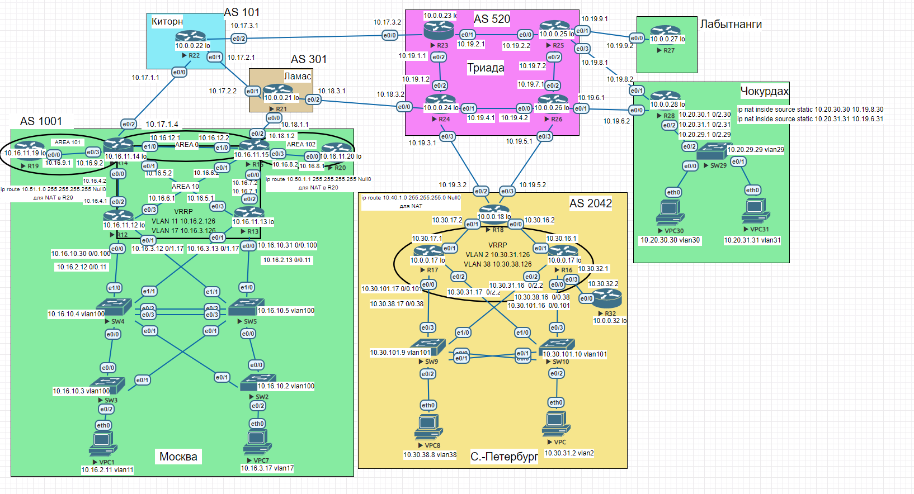

## IPSec over GRE, DmVPN

### Цель:
- Настроить GRE поверх IPSec между офисами Москва и С.-Петербург
- Настроить DMVPN поверх IPSec между офисами Москва и Чокурдах, Лабытнанги

### Описание/Пошаговая инструкция выполнения домашнего задания:

В этой самостоятельной работе мы ожидаем, что вы самостоятельно:

- Настроите GRE поверх IPSec между офисами Москва и С.-Петербург.
- Настроите DMVPN поверх IPSec между Москва и Чокурдах, Лабытнанги.
- Все узлы в офисах в лабораторной работе должны иметь IP связность.

### Схема 
 

### 1. Настроите GRE поверх IPSec между офисами Москва и С.-Петербург.


```
R15(config)#crypto ikev2 proposal PHASE1
R15(config-ikev2-proposal)#encryption aes-cbc-128
R15(config-ikev2-proposal)#integrity md5
R15(config-ikev2-proposal)#group 2
R15(config)#crypto ikev2 policy IKEV2
R15(config-ikev2-policy)#proposal PHASE1
R15(config)#crypto ikev2 profile PROFILE1
R15(config-ikev2-profile)#match address local interface ethernet 0/2
R15(config-ikev2-profile)#match identity remote address 10.19.3.2 255.255.255.255
R15(config-ikev2-profile)#authentication remote pre-share key cisco123
R15(config-ikev2-profile)#authentication local pre-share key cisco123
R15(config)#crypto ipsec transform-set IPSEC_TS esp-aes esp-md5-hmac
R15(cfg-crypto-trans)#mode tunnel
R15(config)#crypto map IPSEC 1 ipsec-isakmp
R15(config-crypto-map)#set peer 10.19.3.2
R15(config-crypto-map)#set transform-set IPSEC_TS
R15(config-crypto-map)#set pfs group5
R15(config-crypto-map)#set ikev2-profile PROFILE1
R15(config-crypto-map)#match address R15_to_R18
R15(config)#crypto isakmp invalid-spi-recovery
R15(config)#ip access-list extended R15_to_R18
R15(config-ext-nacl)#permit gre host 10.18.1.2 host 10.19.3.2
R15(config)#interface ethernet 0/2
R15(config-if)#crypto map IPSEC
```

```
R18(config)#crypto ikev2 proposal PHASE1
R18(config-ikev2-proposal)#encryption aes-cbc-128
R18(config-ikev2-proposal)#integrity md5
R18(config-ikev2-proposal)#group 2
R18(config)#crypto ikev2 policy IKEV2
R18(config-ikev2-policy)#proposal PHASE1
R18(config)#crypto ikev2 profile PROFILE1
R18(config-ikev2-profile)#match address local interface ethernet 0/2
R18(config-ikev2-profile)#match identity remote address 10.18.1.2 255.255.255.255
R18(config-ikev2-profile)#authentication remote pre-share key cisco123
R18(config-ikev2-profile)#authentication local pre-share key cisco123
R18(config)#crypto ipsec transform-set IPSEC_TS esp-aes esp-md5-hmac
R18(cfg-crypto-trans)#mode tunnel
R18(config)#crypto map IPSEC 1 ipsec-isakmp
R18(config-crypto-map)#set peer 10.18.1.2
R18(config-crypto-map)#set transform-set IPSEC_TS
R18(config-crypto-map)#set pfs group5
R18(config-crypto-map)#set ikev2-profile PROFILE1
R18(config-crypto-map)#match address R18_to_R15
R18(config)#crypto isakmp invalid-spi-recovery
R18(config)#ip access-list extended R18_to_R15
R18(config-ext-nacl)#permit gre host 10.19.3.2 host 10.18.1.2
R18(config)#interface ethernet 0/2
R18(config-if)#crypto map IPSEC
```

Пускаем трафик через туннель из сети Москва в сеть С.-Петербург

```
VPC1> ping 10.30.38.8

84 bytes from 10.30.38.8 icmp_seq=1 ttl=60 time=2.701 ms
84 bytes from 10.30.38.8 icmp_seq=2 ttl=60 time=1.685 ms
84 bytes from 10.30.38.8 icmp_seq=3 ttl=60 time=1.317 ms
84 bytes from 10.30.38.8 icmp_seq=4 ttl=60 time=1.519 ms

VPC1> trace 10.30.8.8
trace to 10.30.8.8, 8 hops max, press Ctrl+C to stop
 1   10.16.2.12   0.607 ms  0.333 ms  0.526 ms
 2   10.16.6.2   0.575 ms  0.476 ms  0.427 ms
 3   10.110.0.2   1.037 ms  0.909 ms  0.842 ms
 4   *10.110.0.2   0.858 ms (ICMP type:3, code:1, Destination host unreachable) 
```

Проверяем ipsec

```
R15#show crypto session
Crypto session current status

Interface: Ethernet0/2
Profile: PROFILE1
Session status: UP-ACTIVE
Peer: 10.19.3.2 port 500
  Session ID: 2
  IKEv2 SA: local 10.18.1.2/500 remote 10.19.3.2/500 Active
  IPSEC FLOW: permit 47 host 10.18.1.2 host 10.19.3.2
        Active SAs: 2, origin: crypto map
```

```
R18#sho crypto ikev2 session
 IPv4 Crypto IKEv2 Session

Session-id:7, Status:UP-ACTIVE, IKE count:1, CHILD count:1

Tunnel-id Local                 Remote                fvrf/ivrf            Status
1         10.19.3.2/500         10.18.1.2/500         none/none            READY
      Encr: AES-CBC, keysize: 128, PRF: MD5, Hash: MD596, DH Grp:2, Auth sign: PSK, Auth verify: PSK
      Life/Active Time: 86400/1237 sec
Child sa: local selector  10.19.3.2/0 - 10.19.3.2/65535
          remote selector 10.18.1.2/0 - 10.18.1.2/65535
          ESP spi in/out: 0xD15D45A2/0x3E664E59

 IPv6 Crypto IKEv2 Session
```

### 2. Настроите DMVPN поверх IPSec между Москва и Чокурдах, Лабытнанги.


R15 Москва HUB 
```
R15(config)#crypto isakmp policy 10
R15(config-isakmp)#authentication pre-share
R15(config-isakmp)#encryption aes 128
R15(config-isakmp)#hash sha256
R15(config-isakmp)#group 5
R15(config)#crypto ipsec transform-set DMVPN_TS esp-aes esp-sha-hmac
R15(config)#crypto isakmp key dmvpnkey address 0.0.0.0
R15(config)#crypto ipsec profile DMVPN_PROFILE
R15(ipsec-profile)#set transform-set DMVPN_TS
R15(config)#interface tunnel 100
R15(config-if)#tunnel protection ipsec profile DMVPN_PROFILE
```

R27 Лабытнаги клиент

```
R27(config)#crypto isakmp policy 10
R27(config-isakmp)#authentication pre-share
R27(config-isakmp)#encryption aes 128
R27(config-isakmp)#hash sha256
R27(config-isakmp)#group 5
R27(config)#crypto ipsec transform-set DMVPN_TS esp-aes esp-sha-hmac
R27(cfg-crypto-trans)#crypto isakmp key dmvpnkey address 0.0.0.0
R27(config)#crypto ipsec profile DMVPN_PROFILE
R27(ipsec-profile)#set transform-set DMVPN_TS
R27(config)#crypto isakmp invalid-spi-recovery
R27(config)#interface tunnel 100
R27(config-if)#tunnel protection ipsec profile DMVPN_PROFILE
```

R28 Чокурдах клиент

```
R28(config)#crypto isakmp policy 10
R28(config-isakmp)#authentication pre-share
R28(config-isakmp)#encryption aes 128
R28(config-isakmp)#hash sha256
R28(config-isakmp)#group 5
R28(config)#crypto ipsec transform-set DMVPN_TS esp-aes esp-sha-hmac
R28(cfg-crypto-trans)#crypto isakmp key dmvpnkey address 0.0.0.0
R28(config)#crypto ipsec profile DMVPN_PROFILE
R28(ipsec-profile)#set transform-set DMVPN_TS
R28(config)#crypto isakmp invalid-spi-recovery
R28(config)#interface tunnel 100
R28(config-if)#tunnel protection ipsec profile DMVPN_PROFILE
```

Тоннели поднялись

```
R15#show crypto session
Crypto session current status

Interface: Ethernet0/2
Profile: PROFILE1
Session status: UP-ACTIVE
Peer: 10.19.3.2 port 500
  Session ID: 2
  IKEv2 SA: local 10.18.1.2/500 remote 10.19.3.2/500 Active
  IPSEC FLOW: permit 47 host 10.18.1.2 host 10.19.3.2
        Active SAs: 2, origin: crypto map

Interface: Tunnel100
Session status: UP-ACTIVE
Peer: 10.19.9.2 port 500
  Session ID: 0
  IKEv1 SA: local 10.18.1.2/500 remote 10.19.9.2/500 Active
  IPSEC FLOW: permit 47 host 10.18.1.2 host 10.19.9.2
        Active SAs: 2, origin: crypto map

Interface: Tunnel100
Session status: UP-ACTIVE
Peer: 10.19.6.2 port 500
  Session ID: 0
  IKEv1 SA: local 10.18.1.2/500 remote 10.19.6.2/500 Active
  IPSEC FLOW: permit 47 host 10.18.1.2 host 10.19.6.2
        Active SAs: 2, origin: crypto map
```

```
R15#
R15#show crypto ikev2 session
 IPv4 Crypto IKEv2 Session

Session-id:2, Status:UP-ACTIVE, IKE count:1, CHILD count:1

Tunnel-id Local                 Remote                fvrf/ivrf            Status
1         10.18.1.2/500         10.19.3.2/500         none/none            READY
      Encr: AES-CBC, keysize: 128, PRF: MD5, Hash: MD596, DH Grp:2, Auth sign: PSK, Auth verify: PSK
      Life/Active Time: 86400/67 sec
Child sa: local selector  10.18.1.2/0 - 10.18.1.2/65535
          remote selector 10.19.3.2/0 - 10.19.3.2/65535
          ESP spi in/out: 0x94BE9F9E/0x86A797ED

 IPv6 Crypto IKEv2 Session
```

```
R15#show crypto isakmp peer
Peer: 10.19.6.2 Port: 500 Local: 10.18.1.2
 Phase1 id: 10.19.6.2
Peer: 10.19.9.2 Port: 500 Local: 10.18.1.2
 Phase1 id: 10.19.9.2
```
