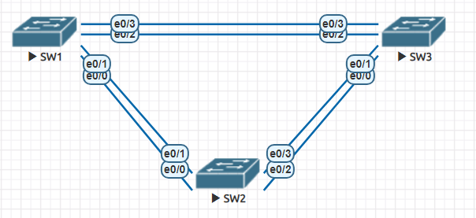

# Лабораторная работа - Развертывание коммутируемой сети с резервными каналами

## Топология

### Таблица адресации

| Устройство | Интерфейс | IP-адрес      | Маска подсети |
|------------|-----------|---------------|---------------|
| S1         | VLAN 1    | 192.168.1.1   | 255.255.255.0 | 
| S2         | VLAN 1    | 192.168.1.2   | 255.255.255.0 |
| S3         | VLAN 1    | 192.168.1.3   | 255.255.255.0 | 

## Цели

Создание сети и настройка основных параметров устройства
Выбор корневого моста
Наблюдение за процессом выбора протоколом STP порта, исходя из стоимости портов
Наблюдение за процессом выбора протоколом STP порта, исходя из приоритета портов
