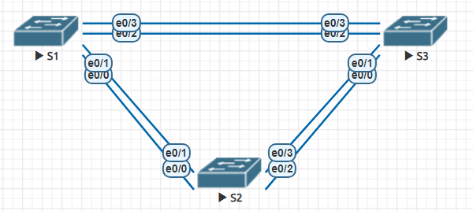

## Лабораторная работа - Развертывание коммутируемой сети с резервными каналами

### Топология

### Таблица адресации

| Устройство | Интерфейс | IP-адрес      | Маска подсети |
|------------|-----------|---------------|---------------|
| S1         | VLAN 1    | 192.168.1.1   | 255.255.255.0 | 
| S2         | VLAN 1    | 192.168.1.2   | 255.255.255.0 |
| S3         | VLAN 1    | 192.168.1.3   | 255.255.255.0 | 

### Цели

- Создание сети и настройка основных параметров устройства
- Выбор корневого моста
- Наблюдение за процессом выбора протоколом STP порта, исходя из стоимости портов
- Наблюдение за процессом выбора протоколом STP порта, исходя из приоритета портов

### Необходимые ресурсы
- 3 коммутатора
- Консольные кабели для настройки устройств Cisco IOS через консольные порты
- Кабели Ethernet, расположенные в соответствии с топологией


### Базовая настройка устройств

**S1 Базовая настройка:**

```
Switch#enable
Switch#configure terminal
Switch(config)#hostname S1
S1(config)#no ip domain-lookup
S1(config)#enable secret class
S1(config)#line console 0
S1(config-line)#password cisco
S1(config-line)#login
S1(config-line)#logging synchronous
S1(config-line)#line vty 0 4
S1(config-line)#password cisco
S1(config-line)#login
S1(config-line)#logging synchronous
S1(config-line)#service password-encryption
S1(config)#banner motd "Unauthorized access is prohibited"
S1(config)#interface vlan 1
S1(config-if)#ip address 192.168.1.1 255.255.255.0
S1(config-if)#no shutdown
S1(config-if)#end
S1#write
```

**S2 Базовая настройка:**
```
Switch#enable
Switch#configure terminal
Switch(config)#hostname S2
S2(config)#no ip domain-lookup
S2(config)#enable secret class
S2(config)#line console 0
S2(config-line)#password cisco
S2(config-line)#login
S2(config-line)#logging synchronous
S2(config-line)#line vty 0 4
S2(config-line)#password cisco
S2(config-line)#login
S2(config-line)#logging synchronous
S2(config-line)#service password-encryption
S2(config)#banner motd "Unauthorized access is prohibited"
S2(config)#interface vlan 1
S2(config-if)#ip address 192.168.1.2 255.255.255.0
S2(config-if)#no shutdown
S2(config-if)#end
S2#write
```

**S3 Базовая настройка:**
```
Switch#enable
Switch#configure terminal
Switch(config)#hostname S3
S3(config)#no ip domain-lookup
S3(config)#enable secret class
S3(config)#line console 0
S3(config-line)#password cisco
S3(config-line)#login
S3(config-line)#logging synchronous
S3(config-line)#line vty 0 4
S3(config-line)#password cisco
S3(config-line)#login
S3(config-line)#logging synchronous
S3(config-line)#service password-encryption
S3(config)#banner motd "Unauthorized access is prohibited"
S3(config)#interface vlan 1
S3(config-if)#ip address 192.168.1.3 255.255.255.0
S3(config-if)#no shutdown
S3(config-if)#end
S3#write
```

### Проверка связи между коммутаторами
**Успешно ли выполняется эхо-запрос от коммутатора S1 на коммутатор S2?**
```
S1#ping 192.168.1.2
Type escape sequence to abort.
Sending 5, 100-byte ICMP Echos to 192.168.1.2, timeout is 2 seconds:
.!!!!
Success rate is 80 percent (4/5), round-trip min/avg/max = 1/1/1 ms
```
**Успешно ли выполняется эхо-запрос от коммутатора S1 на коммутатор S2?**
```
S1#ping 192.168.1.3
Type escape sequence to abort.
Sending 5, 100-byte ICMP Echos to 192.168.1.3, timeout is 2 seconds:
.!!!!
Success rate is 80 percent (4/5), round-trip min/avg/max = 1/1/1 ms
```
**Успешно ли выполняется эхо-запрос от коммутатора S2 на коммутатор S3?**
```
S2#ping 192.168.1.3
Type escape sequence to abort.
Sending 5, 100-byte ICMP Echos to 192.168.1.3, timeout is 2 seconds:
!!!!!
Success rate is 100 percent (5/5), round-trip min/avg/max = 1/1/1 ms
```

### 2. Выбор корневого моста
**Выполняем настройки на коммутаторах**
```
S1#configure terminal
S1(config)#interface range ethernet 0/0-3
S1(config-if-range)#shutdown
S1(config-if-range)#switchport trunk encapsulation dot1q
S1(config-if-range)#switchport mode trunk
S1(config-if-range)#switchport trunk allowed vlan 1
S1(config-if-range)#exit
S1(config)#interface ethernet 0/1
S1(config-if)#no shutdown
S1(config-if)#exit
S1(config)#interface ethernet 0/3
S1(config-if)#no shutdown
S1(config-if)#exit
S1# write
```
```
S2#configure terminal
S2(config)#interface range ethernet 0/0-3
S2(config-if-range)#shutdown
S2(config-if-range)#switchport trunk encapsulation dot1q
S2(config-if-range)#switchport mode trunk
S2(config-if-range)#switchport trunk allowed vlan 1
S2(config-if-range)#exit
S2(config)#interface ethernet 0/1
S2(config-if)#no shutdown
S2(config-if)#exit
S2(config)#interface ethernet 0/3
S2(config-if)#no shutdown
S2(config-if)#exit
S2# write
```
```
S3#configure terminal
S3(config)#interface range ethernet 0/0-3
S3(config-if-range)#shutdown
S3(config-if-range)#switchport trunk encapsulation dot1q
S3(config-if-range)#switchport mode trunk
S3(config-if-range)#switchport trunk allowed vlan 1
S3(config-if-range)#exit
S3(config)#interface ethernet 0/1
S3(config-if)#no shutdown
S3(config-if)#exit
S3(config)#interface ethernet 0/3
S3(config-if)#no shutdown
S3(config-if)#exit
S3# write
```
**Результат show spanning-tree на S1**
```
S1#show spanning-tree 

VLAN0001
  Spanning tree enabled protocol ieee
  Root ID    Priority    32769
             Address     aabb.cc00.1000
             This bridge is the root
             Hello Time   2 sec  Max Age 20 sec  Forward Delay 15 sec

  Bridge ID  Priority    32769  (priority 32768 sys-id-ext 1)
             Address     aabb.cc00.1000
             Hello Time   2 sec  Max Age 20 sec  Forward Delay 15 sec
             Aging Time  300 sec

Interface           Role Sts Cost      Prio.Nbr Type
------------------- ---- --- --------- -------- --------------------------------
Et0/1               Desg FWD 100       128.2    Shr 
Et0/3               Desg FWD 100       128.4    Shr 

```

**Результат show spanning-tree на S2**
```
S2#show spanning-tree 

VLAN0001
  Spanning tree enabled protocol ieee
  Root ID    Priority    32769
             Address     aabb.cc00.1000
             Cost        100
             Port        2 (Ethernet0/1)
             Hello Time   2 sec  Max Age 20 sec  Forward Delay 15 sec

  Bridge ID  Priority    32769  (priority 32768 sys-id-ext 1)
             Address     aabb.cc00.2000
             Hello Time   2 sec  Max Age 20 sec  Forward Delay 15 sec
             Aging Time  300 sec

Interface           Role Sts Cost      Prio.Nbr Type
------------------- ---- --- --------- -------- --------------------------------
Et0/1               Root FWD 100       128.2    Shr 
Et0/3               Desg FWD 100       128.4    Shr 

```

**Результат show spanning-tree на S3**
```
S3#show spanning-tree 

VLAN0001
  Spanning tree enabled protocol ieee
  Root ID    Priority    32769
             Address     aabb.cc00.1000
             Cost        100
             Port        4 (Ethernet0/3)
             Hello Time   2 sec  Max Age 20 sec  Forward Delay 15 sec

  Bridge ID  Priority    32769  (priority 32768 sys-id-ext 1)
             Address     aabb.cc00.3000
             Hello Time   2 sec  Max Age 20 sec  Forward Delay 15 sec
             Aging Time  300 sec

Interface           Role Sts Cost      Prio.Nbr Type
------------------- ---- --- --------- -------- --------------------------------
Et0/1               Altn BLK 100       128.2    Shr 
Et0/3               Root FWD 100       128.4    Shr 
```
**Какой коммутатор является корневым мостом?**

Корневым мостом стал коммутатор S1, MAC-адрес с самым низким значением.

**Какие порты на коммутаторе являются корневыми портами?** 

Корневые порты: S2 - Et0/1; S3 - Et0/3.

**Какие порты на коммутаторе являются назначенными портами?**

Назначенные порты: S1 - Et0/1, Et0/3; S2 - Et0/3.

**Какой порт отображается в качестве альтернативного и в настоящее время заблокирован?** 

Альтернативные порт: S3 - Et0/1.

**Почему протокол spanning-tree выбрал этот порт в качестве невыделенного (заблокированного) порта?**

Порт S3,Et0/1 выбран в качестве альтернативного (заблокированного), потому что имеет больший больший BridgeID (priority одинаковый, mac address больше).

### 3. Наблюдение за процессом выбора протоколом STP порта, исходя из стоимости портов
**На S3 меняем стоимость порта:**
```
S3(config)#interface e0/3
S3(config-if)#spanning-tree cost 18
S3(config)#do show spanning-tree 
```
```
VLAN0001
  Spanning tree enabled protocol ieee
  Root ID    Priority    32769
             Address     aabb.cc00.1000
             Cost        18
             Port        4 (Ethernet0/3)
             Hello Time   2 sec  Max Age 20 sec  Forward Delay 15 sec

  Bridge ID  Priority    32769  (priority 32768 sys-id-ext 1)
             Address     aabb.cc00.3000
             Hello Time   2 sec  Max Age 20 sec  Forward Delay 15 sec
             Aging Time  300 sec

Interface           Role Sts Cost      Prio.Nbr Type
------------------- ---- --- --------- -------- --------------------------------
Et0/1               Desg FWD 100       128.2    Shr
Et0/3               Root FWD 18        128.4    Shr
```

**В результате блокируемый порт стал Et0/3 на S2**
```
S2#show spanning-tree 
```
```
VLAN0001
  Spanning tree enabled protocol ieee
  Root ID    Priority    32769
             Address     aabb.cc00.1000
             Cost        100
             Port        2 (Ethernet0/1)
             Hello Time   2 sec  Max Age 20 sec  Forward Delay 15 sec

  Bridge ID  Priority    32769  (priority 32768 sys-id-ext 1)
             Address     aabb.cc00.2000
             Hello Time   2 sec  Max Age 20 sec  Forward Delay 15 sec
             Aging Time  300 sec

Interface           Role Sts Cost      Prio.Nbr Type
------------------- ---- --- --------- -------- --------------------------------
Et0/1               Root FWD 100       128.2    Shr
Et0/3               Altn BLK 100       128.4    Shr
```
**Удаляем изменение стоимости порта на S3:**
```
S3(config)#interface e0/3
S3(config-if)#no spanning-tree cost 18
S3(config-if)#do show spanning-tree
```
Блокируемый порт вновь стал Et0/1 на S3.
```
VLAN0001
  Spanning tree enabled protocol ieee
  Root ID    Priority    32769
             Address     aabb.cc00.1000
             Cost        100
             Port        4 (Ethernet0/3)
             Hello Time   2 sec  Max Age 20 sec  Forward Delay 15 sec

  Bridge ID  Priority    32769  (priority 32768 sys-id-ext 1)
             Address     aabb.cc00.3000
             Hello Time   2 sec  Max Age 20 sec  Forward Delay 15 sec
             Aging Time  300 sec

Interface           Role Sts Cost      Prio.Nbr Type
------------------- ---- --- --------- -------- --------------------------------
Et0/1               Altn BLK 100       128.2    Shr
Et0/3               Root FWD 100       128.4    Shr
```
#### 4. Наблюдение за процессом выбора протоколом STP порта, исходя из приоритета портов
Включаем избыточные пути на всех коммутаторах
```
S1,2,3(config)#interface ethernet 0/0
S1,2,3(config-if)#no shutdown
S1,2,3(config-if)#exit
S1,2,3(config)#interface ethernet 0/2
S1,2,3(config-if)#no shutdown
S1,2,3(config-if)#exit
```
**Какой порт выбран протоколом STP в качестве порта корневого моста на каждом коммутаторе некорневого моста?**

Корневым портом на S2 стал Et0/0 (наименьший из возможных Et0/0 и Et0/1):
```
S2#show spanning-tree 

VLAN0001
  Spanning tree enabled protocol ieee
  Root ID    Priority    32769
             Address     aabb.cc00.1000
             Cost        100
             Port        1 (Ethernet0/0)
             Hello Time   2 sec  Max Age 20 sec  Forward Delay 15 sec

  Bridge ID  Priority    32769  (priority 32768 sys-id-ext 1)
             Address     aabb.cc00.2000
             Hello Time   2 sec  Max Age 20 sec  Forward Delay 15 sec
             Aging Time  300 sec

Interface           Role Sts Cost      Prio.Nbr Type
------------------- ---- --- --------- -------- --------------------------------
Et0/0               Root FWD 100       128.1    Shr 
Et0/1               Altn BLK 100       128.2    Shr 
Et0/2               Desg FWD 100       128.3    Shr 
Et0/3               Desg FWD 100       128.4    Shr 
```
Корневым портом на S3 стал Et0/2 (наименьший из возможных Et0/2 и Et0/3):
```
S3#show spanning-tree 

VLAN0001
  Spanning tree enabled protocol ieee
  Root ID    Priority    32769
             Address     aabb.cc00.1000
             Cost        100
             Port        3 (Ethernet0/2)
             Hello Time   2 sec  Max Age 20 sec  Forward Delay 15 sec

  Bridge ID  Priority    32769  (priority 32768 sys-id-ext 1)
             Address     aabb.cc00.3000
             Hello Time   2 sec  Max Age 20 sec  Forward Delay 15 sec
             Aging Time  300 sec

Interface           Role Sts Cost      Prio.Nbr Type
------------------- ---- --- --------- -------- --------------------------------
Et0/0               Altn BLK 100       128.1    Shr 
Et0/1               Altn BLK 100       128.2    Shr 
Et0/2               Root FWD 100       128.3    Shr 
Et0/3               Altn BLK 100       128.4    Shr 
```
**Какой порт выбран протоколом STP в качестве порта корневого моста на каждом коммутаторе некорневого моста?**

Корневой порт выбирается на основании наименьшей «стоимости» пути к корневому коммутатору. Стоимость пути выражается из стоимости линков, ведущих к корневому коммутатору.

**Почему протокол STP выбрал эти порты в качестве портов корневого моста на этих коммутаторах?**

STP выбирает порт корневого моста на основе стоимости пути.Порт с наименьшей стоимостью пути к корневому мосту будет выбран как Root Port.

**Какое значение протокол STP использует первым после выбора корневого моста, чтобы определить выбор порта?**

Первым шагом протокола STP является определение корневого коммутатора

**Если первое значение на двух портах одинаково, какое следующее значение будет использовать протокол STP при выборе порта?**

Если стоимость пути на двух портах одинакова, STP использует следующее значение для выбора порта — это Bridge ID

**Если оба значения на двух портах равны, каким будет следующее значение, которое использует протокол STP при выборе порта?**

STP выберет порт с наименьшим Port ID